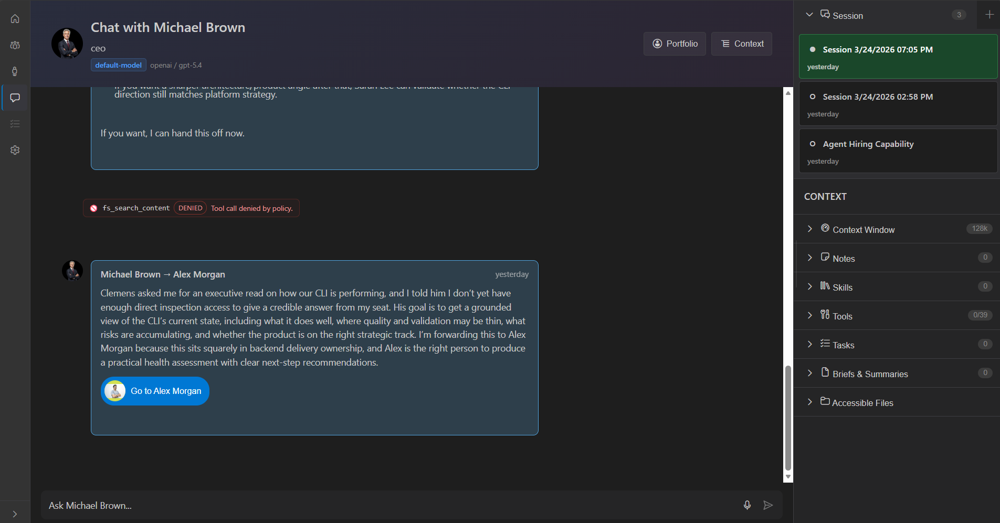
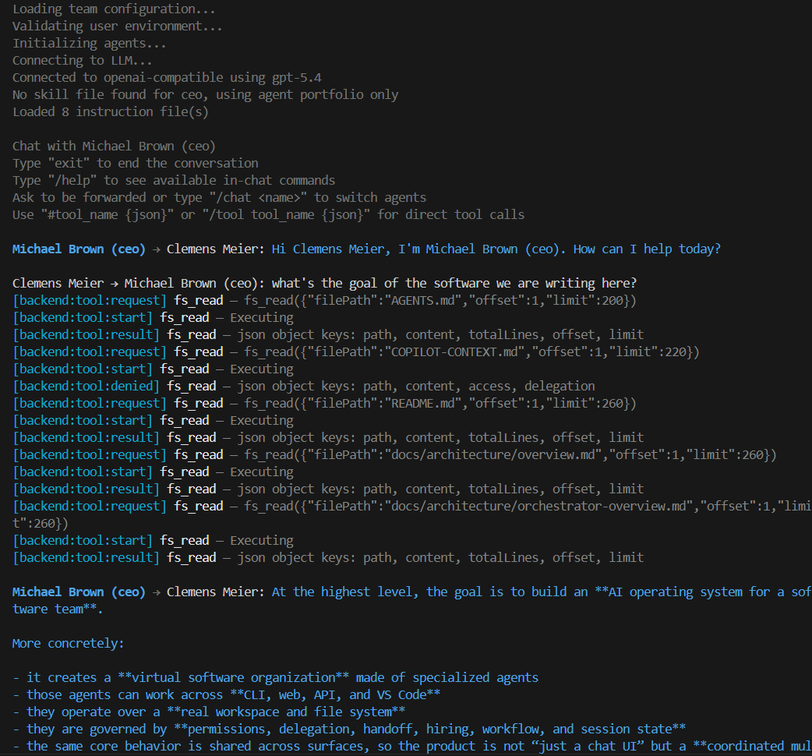
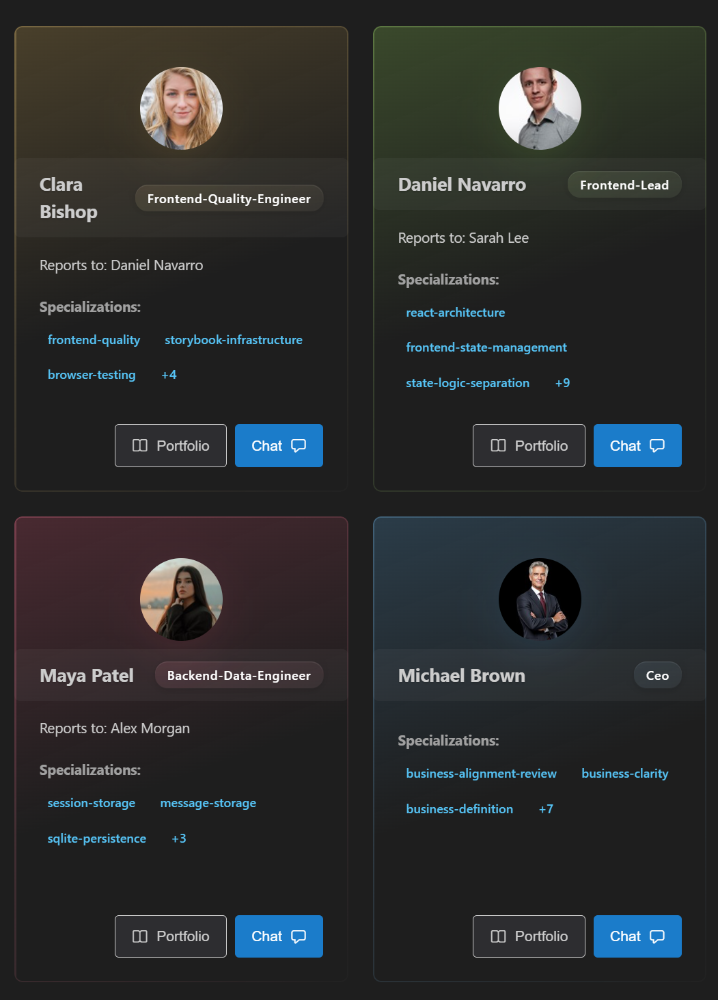
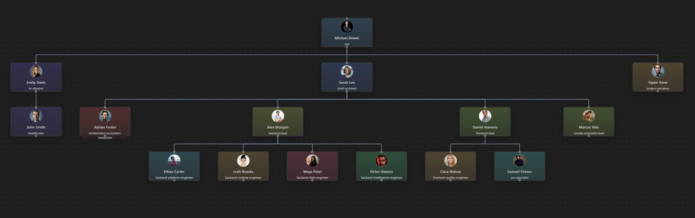
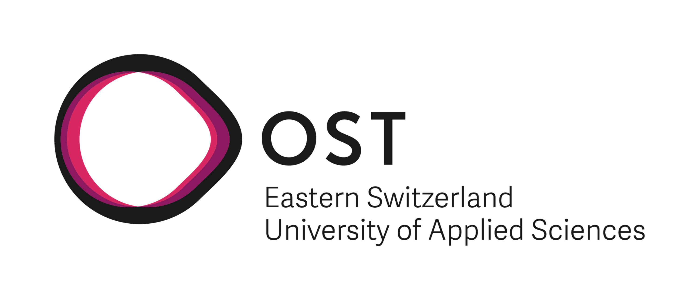

# AI Team - Software Architecture Through Agent Responsibilities

   <svg width="140" height="140" viewBox="0 0 128 128" xmlns="http://www.w3.org/2000/svg" aria-label="AI Team Logo">
      <defs>
         <linearGradient id="ai-team-logo-grad" x1="0%" y1="0%" x2="100%" y2="100%">
            <stop offset="0%" stop-color="#007acc" stop-opacity="1" />
            <stop offset="100%" stop-color="#00a8e8" stop-opacity="1" />
         </linearGradient>
      </defs>
      <circle cx="64" cy="40" r="16" fill="url(#ai-team-logo-grad)" stroke="#cccccc" stroke-width="2" />
      <circle cx="32" cy="88" r="12" fill="url(#ai-team-logo-grad)" stroke="#cccccc" stroke-width="2" />
      <circle cx="64" cy="88" r="12" fill="url(#ai-team-logo-grad)" stroke="#cccccc" stroke-width="2" />
      <circle cx="96" cy="88" r="12" fill="url(#ai-team-logo-grad)" stroke="#cccccc" stroke-width="2" />
      <line x1="64" y1="56" x2="32" y2="76" stroke="#007acc" stroke-width="2" opacity="0.6" />
      <line x1="64" y1="56" x2="64" y2="76" stroke="#007acc" stroke-width="2" opacity="0.6" />
      <line x1="64" y1="56" x2="96" y2="76" stroke="#007acc" stroke-width="2" opacity="0.6" />
   </svg>

AI Team is an open-source effort to make software development with AI feel reliable, structured, and team-aware. It’s not just a single assistant—it’s a system for coordinating multiple specialized agents, each bound to clear responsibilities and architectural boundaries.

## Project Goal

While individual AI coding tools accelerate isolated tasks, they lack structural and collective awareness within teams. A shared codebase is a socio-technical artifact of shifting conventions. Large context windows expose AI to conflicting historical patterns, causing it to replicate legacy defects and introduce cross-cutting regressions that break adjacent sub-systems. Even spec-driven frameworks desynchronize as repositories evolve. Furthermore, unconstrained contexts require expensive frontier models, whereas restricting focus to localized scopes enables smaller, efficient models to operate productively. Engineering teams require an active governance mechanism mapping architectural context boundaries onto agent constraints.

AI-Team anchors multi-agent orchestration in traditional software engineering paradigms. Rather than deploying a monolithic, unconstrained LLM context, we map specialized agents directly onto predefined structural responsibilities, operationalizing architectural patterns, technical layers, and DDD Bounded Contexts. Programmatically encoding behaviors, permissions, and handoff protocols into the repository creates an externalized cognitive scaffold. Instead of wasting compute on broad repository searches, these encoded paths guide agents and humans directly to the problem site, keeping context strictly scoped, clean, and relevant.

AI-Team translates abstract design patterns into strict multi-agent guardrails. High-impact zones are tightly controlled: shared API contracts are restricted to higher-level agents to prevent breaking changes, while core business logic is insulated via verification workflows. Domain-specific automated checks trigger upon task completion. Because these boundaries are version-controlled, they serve as a live, self-documenting architectural blueprint. This eliminates out-of-date documentation, significantly accelerates developer onboarding via an executable map of responsibilities, and offloads gatekeeping so engineering teams can safely scale human cognition.

The goal is to evolve this into an open source coding tool of the future—one that makes architectural intent executable, keeps teams aligned, and reduces regressions as systems grow.

## What you’ll find here

- A TypeScript monorepo with CLI, VS Code, and web adapters
- A file-backed runtime model under `.ai-team/`
- Clear package boundaries between core domain logic, orchestration, and adapters
- Documentation that connects architecture intent to implementation surfaces

## Package docs

- Core: [packages/core/README.md](packages/core/README.md)
- Service: [packages/service/](packages/service/)
- Container: [packages/container/](packages/container/)
- Infrastructure: [packages/infrastructure/](packages/infrastructure/)
- API contracts: [packages/api-contracts/](packages/api-contracts/)
- API server: [packages/api-server/README.md](packages/api-server/README.md) - REST API with Swagger UI docs
- CLI: [packages/cli/README.md](packages/cli/README.md)
- VS Code adapter: [packages/vscode/README.md](packages/vscode/README.md)
- Web adapter: [packages/web/README.md](packages/web/README.md)

## Analysis system docs

- Overview and pipeline entry points: [analysis/README.md](analysis/README.md)
- Schema contracts and validators: [analysis/contracts/README.md](analysis/contracts/README.md)
- TypeScript collector: [analysis/collectors/typescript/README.md](analysis/collectors/typescript/README.md)
- CSS collector: [analysis/collectors/css/](analysis/collectors/css/)
- Config collector: [analysis/collectors/config/](analysis/collectors/config/)
- Markdown collector: [analysis/collectors/markdown/](analysis/collectors/markdown/)
- Collector shared utilities: [analysis/collectors/shared/](analysis/collectors/shared/)
- Complexity calculators: [analysis/complexity/](analysis/complexity/)
- Duplication calculators: [analysis/duplication/](analysis/duplication/)
- SOLID + cohesion calculators: [analysis/solid/](analysis/solid/)
- Structural pipeline: [analysis/structural/](analysis/structural/)
- Viewer component library: [analysis/viewer/](analysis/viewer/)
- Viewer app: [analysis/viewer-app/](analysis/viewer-app/)

## Screenshots

## Get the app running

Single-command quickstart:

- `pnpm dev` (starts web + API server)

Or run them separately:

- `pnpm --filter @ai-team/web dev` (starts the web app)
- `pnpm --filter @ai-team/api-server dev` (starts the API server)

1. Install dependencies
   - `pnpm install`
2. Start the web app
   - `pnpm --filter @ai-team/web dev`
3. Start the API server in another terminal
   - `pnpm --filter @ai-team/api-server dev`

Open `http://localhost:3000`. The app will guide you from there.

## Configure model keys and provider URLs

AI Team reads model credentials from `.ai-team/.env` (gitignored). Add your keys there and restart the API server.

Minimum setup:

- `AI_TEAM_USER_NAME` — shown to agents
- Provider API key — use the env var configured by your provider (see below)

Fallback order for API keys is:

1. Provider-specific env var (from `.ai-team/config.user.json` → `providers.<name>.apiKeyEnvVar`)
2. `AI_TEAM_LLM_API_KEY`
3. `LLM_API_KEY`
4. `OPENAI_API_KEY`

Provider URLs and defaults live in `.ai-team/config.user.json`:

- `providers.<name>.baseUrl` — API endpoint for that provider (e.g. `https://api.openai.com/v1`, `http://localhost:11434/v1`)
- `providers.<name>.apiKeyEnvVar` — the env var name the provider expects
- `defaultModel` — the default provider + model the app boots with
- `modelKeys` — named shortcuts like `cheap`, `best`, `coding`, `thinking`
- `developer.avatar` / `developer.portfolioUrl` — profile links shown in the UI

## Build and Test

- Install: `pnpm install`
- Build all: `pnpm -r build`
- Test all: `pnpm -r test`

For package-specific verification and guardrails, follow [.github/copilot-instructions.md](.github/copilot-instructions.md).

   

