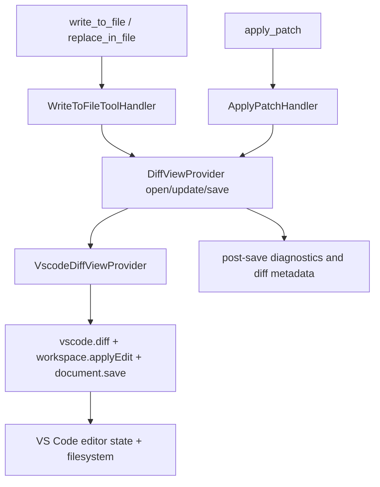
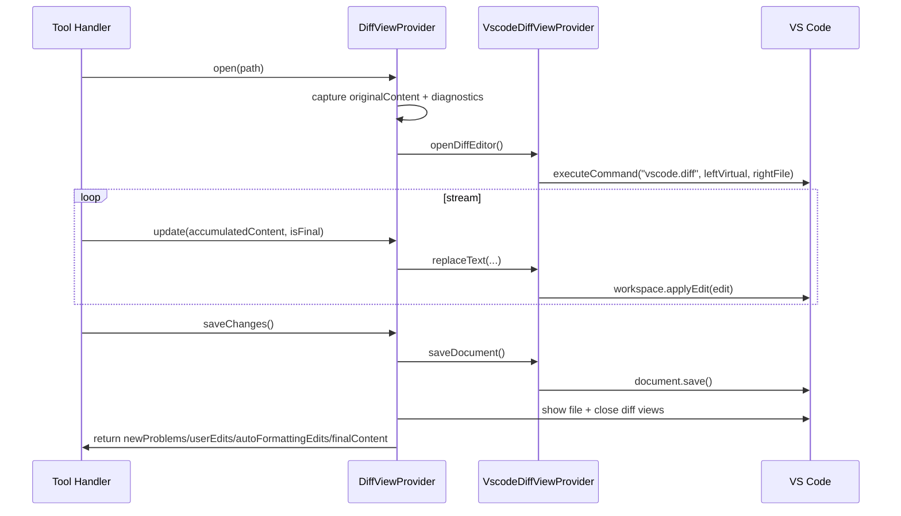

# Cline → VS Code: write, notification, diff, and filesystem behavior

## Purpose and scope

This document captures **how Cline actually works** for:

- write operations,
- notifications,
- diff rendering,
- VS Code synchronization and filesystem updates.

Analyzed files:

- `src/extension.ts`
- `src/hosts/vscode/VscodeDiffViewProvider.ts`
- `src/integrations/editor/DiffViewProvider.ts`
- `src/core/task/tools/handlers/WriteToFileToolHandler.ts`
- `src/core/task/tools/handlers/ApplyPatchHandler.ts`
- `src/integrations/editor/FileEditProvider.ts`
- `src/hosts/vscode/hostbridge/diff/openMultiFileDiff.ts`

---

## High-level architecture



Core finding: Cline does **not** use a separate "filesystem changed" callback to VS Code in this path. It drives VS Code through native editor operations (`applyEdit`, `save`), and VS Code reflects those writes.

---

## Module responsibilities

### `src/extension.ts`

- Registers `cline-diff` virtual document content provider.
- Wires host provider factory to `VscodeDiffViewProvider`.

### `src/hosts/vscode/VscodeDiffViewProvider.ts`

- Opens single-file visual diff via `vscode.diff`.
- Streams text replacements through `vscode.workspace.applyEdit`.
- Saves via `document.save()`.
- Closes diff tabs and manages decorations.

### `src/integrations/editor/DiffViewProvider.ts`

- Host-agnostic session lifecycle (`open`, `update`, `saveChanges`, `revertChanges`, `reset`).
- Stores baseline in `originalContent`.
- Tracks pre/post-save content + diagnostics deltas.

### `src/core/task/tools/handlers/WriteToFileToolHandler.ts`

- Orchestrates approval UX and streaming updates.
- Calls `open` → `update` → `saveChanges`.
- Sets internal orchestration state (`taskState.didEditFile = true`).

### `src/core/task/tools/handlers/ApplyPatchHandler.ts`

- Applies multi-file patches with per-file prepare/approve/save.
- Handles move/delete cases.
- Uses provider reset/revert logic on denial/error.

### `src/hosts/vscode/hostbridge/diff/openMultiFileDiff.ts`

- Opens grouped changes view with `vscode.changes`.

### `src/integrations/editor/FileEditProvider.ts`

- Headless fallback (no visual diff).
- Uses in-memory text and `fs.writeFile` for persistence.

---

## Exact write flow in VS Code host



---

## How diff/original content is represented

- Baseline source is `DiffViewProvider.originalContent`.
- For modify operations: read file bytes from disk, detect encoding, decode to text.
- For create operations: baseline is empty string.
- Left diff pane is virtual (`cline-diff:` URI), content supplied by base64 query decoded by registered content provider.
- Right pane is real file URI (editable).

---

## Notification model (important distinction)

| Channel | Mechanism | Notifies whom | Meaning |
| --- | --- | --- | --- |
| VS Code/file updates | `workspace.applyEdit`, `document.save` | VS Code + filesystem | Actual document/file mutation |
| Diff UI | `vscode.diff`, `vscode.changes` | VS Code UI | Render single/multi-file diffs |
| Cline UX notifications | `callbacks.ask/say`, approval notification, feedback events | Cline UI/webview | User approval + model feedback flow |
| Internal orchestration | `taskState.didEditFile`, file context tracker | Cline runtime | Control loop behavior, context tracking |

`didEditFile` is internal runtime state, **not** a VS Code filesystem notification API.

---

## Revert/undo behavior implemented in Cline

`DiffViewProvider.revertChanges()` covers both edit types:

- **Create**: save/close diff, remove created file, remove newly created directories (best effort).
- **Modify**: replace current text with `originalContent`, save, optionally reopen file, close diff tabs.

Handlers call revert+reset on deny/error to prevent stale sessions.

---

## Important evidence snippets

### Register virtual diff content provider (`extension.ts`)

```ts
const diffContentProvider = new (class implements vscode.TextDocumentContentProvider {
  provideTextDocumentContent(uri: vscode.Uri): string {
    return Buffer.from(uri.query, "base64").toString("utf-8")
  }
})()
context.subscriptions.push(vscode.workspace.registerTextDocumentContentProvider(DIFF_VIEW_URI_SCHEME, diffContentProvider))
```

### Open single-file diff (`VscodeDiffViewProvider.ts`)

```ts
vscode.commands.executeCommand(
  "vscode.diff",
  vscode.Uri.parse(`${DIFF_VIEW_URI_SCHEME}:${fileName}`).with({
    query: Buffer.from(this.originalContent ?? "").toString("base64"),
  }),
  uri,
  `${fileName}: ${fileExists ? "Original ↔ Cline's Changes" : "New File"} (Editable)`,
  { preserveFocus: true },
)
```

### Stream edits + save (`VscodeDiffViewProvider.ts`)

```ts
const edit = new vscode.WorkspaceEdit()
edit.replace(document.uri, range, content)
await vscode.workspace.applyEdit(edit)
await this.activeDiffEditor.document.save()
```

### Write tool finalization (`WriteToFileToolHandler.ts`)

```ts
const { newProblemsMessage, userEdits, autoFormattingEdits, finalContent } =
  await config.services.diffViewProvider.saveChanges()
config.taskState.didEditFile = true
```

### Multi-file diff (`openMultiFileDiff.ts`)

```ts
await vscode.commands.executeCommand("vscode.changes", request.title, request.diffs.map(...))
```

---

## Host differences to consider when integrating elsewhere

- VS Code host gives interactive diff UX and editor-driven writes.
- File/headless host can still write correctly but without VS Code diff presentation.
- If you need Cline-like UX in another system, replicate VS Code-host semantics (virtual baseline + diff command + stream edits + save + cleanup), not just file writes.

---

## Integration implications for ai-team (`ait/fs`)

To mirror Cline behavior safely in your architecture:

- Extend `ait/fs` beyond plain write/create/delete so it also supports an explicit `apply_patch` operation path (authorization + auditing).
- Ensure `apply_patch` flows receive the same policy gates as `write_to_file`/`replace_in_file` before plugin calls.
- Align FS operation naming with Cline semantics to reduce translation bugs between tool intent and backend policy.

Recommended naming alignment:

- `write_to_file` (full content write/create)
- `replace_in_file` (targeted replacement/diff-based update)
- `apply_patch` (multi-file patch apply with move/delete support)

Practical benefit: shared naming across ai-team runtime, `ait/fs`, and VS Code plugin APIs makes traces, telemetry, and error handling much easier to reason about.

For the concrete policy model and failure-routing behavior, see:

- `analysis documents/integration-plan-for-another-codebase.md`
  - section **ABAC policy checklist for `ait/fs`**
  - section **Failed tool-call handoff protocol (user-approved)**

Important integration requirement from ai-team context: when `ait/fs` denies a tool call, the response should include **which agent(s) are allowed** so the orchestrator can propose a **user-approved handoff**.

---

## Complete Cline tool inventory (from source)

Authoritative source: `src/shared/tools.ts` (`ClineDefaultTool`) plus handler registration in `src/core/task/tools/ToolExecutorCoordinator.ts`.

### Core tool names exposed by Cline

- `ask_followup_question`
- `attempt_completion`
- `execute_command`
- `replace_in_file`
- `read_file`
- `write_to_file`
- `search_files`
- `list_files`
- `list_code_definition_names`
- `browser_action`
- `use_mcp_tool`
- `access_mcp_resource`
- `load_mcp_documentation`
- `new_task`
- `plan_mode_respond`
- `act_mode_respond`
- `focus_chain`
- `web_fetch`
- `web_search`
- `condense`
- `summarize_task`
- `report_bug`
- `new_rule`
- `apply_patch`
- `generate_explanation`
- `use_skill`
- `use_subagents`

### How they are implemented in Cline

Representative handler mapping (from `ToolExecutorCoordinator.toolHandlersMap`):

| Tool name | Primary handler |
| --- | --- |
| `read_file` | `ReadFileToolHandler` |
| `write_to_file` | `WriteToFileToolHandler` |
| `replace_in_file` | `WriteToFileToolHandler` (shared wrapper) |
| `new_rule` | `WriteToFileToolHandler` (shared wrapper) |
| `apply_patch` | `ApplyPatchHandler` |
| `list_files` | `ListFilesToolHandler` |
| `search_files` | `SearchFilesToolHandler` |
| `list_code_definition_names` | `ListCodeDefinitionNamesToolHandler` |
| `execute_command` | `ExecuteCommandToolHandler` |
| `browser_action` | `BrowserToolHandler` |
| `web_fetch` | `WebFetchToolHandler` |
| `web_search` | `WebSearchToolHandler` |
| `use_mcp_tool` | `UseMcpToolHandler` |
| `access_mcp_resource` | `AccessMcpResourceHandler` |
| `load_mcp_documentation` | `LoadMcpDocumentationHandler` |
| `use_skill` | `UseSkillToolHandler` |
| `use_subagents` | `UseSubagentsToolHandler` |
| `new_task` | `NewTaskHandler` |
| `plan_mode_respond` | `PlanModeRespondHandler` |
| `act_mode_respond` | `ActModeRespondHandler` |
| `summarize_task` | `SummarizeTaskHandler` |
| `report_bug` | `ReportBugHandler` |
| `generate_explanation` | `GenerateExplanationToolHandler` |
| `ask_followup_question` | `AskFollowupQuestionToolHandler` |
| `attempt_completion` | `AttemptCompletionHandler` |
| `condense` | `CondenseHandler` |
| `focus_chain` | no direct handler in map (special/internal flow) |

Note: Cline also supports dynamic tool names (for MCP namespaces and dynamic subagent tools) via `setDynamicToolUseNames(...)` and dynamic subagent handler registration.

---

## What to rename and integrate in ai-team

To reduce translation overhead and policy mistakes, align ai-team tool names to Cline names where practical.

Recommended direct mapping in ai-team:

- filesystem write family:
  - `write_to_file`
  - `replace_in_file`
  - `apply_patch`
  - `read_file`
  - `list_files`
  - `search_files`
  - `list_code_definition_names`
- command/browser/web family:
  - `execute_command`
  - `browser_action`
  - `web_fetch`
  - `web_search`
- orchestration/mode family:
  - `new_task`, `plan_mode_respond`, `act_mode_respond`, `summarize_task`, `attempt_completion`

Minimum requirement from your latest constraint: include **`apply_patch` as a first-class `ait/fs` operation**, not only full-file write operations.

---

## `ait/fs` access-right checks with agent-based access control (ABAC)

Given your note that ait has agent-based access control for all file operations, implement checks as an ABAC gate evaluated before any plugin-side action.

### Suggested authorization tuple

- `agentId`
- `operationType` (aligned with tool name: `read_file`, `write_to_file`, `replace_in_file`, `apply_patch`, etc.)
- `resourcePath` (or resource set for patch)
- `workspaceId` / project context
- optional `sensitivity`, `allowCreate`, `allowDelete`, `allowMove`

### Enforcement order (important)

1. Validate operation payload shape.
2. Resolve and normalize target paths.
3. Evaluate ABAC policy in `ait/fs`.
4. Deny fast if unauthorized (before opening diff or streaming updates).
5. Forward only authorized operations to plugin APIs.

### `apply_patch`-specific ABAC requirements

- Evaluate per-file permissions inside patch:
  - add/create,
  - update/modify,
  - delete,
  - move (requires old-path + new-path authorization).
- If any patch segment is unauthorized, reject the whole patch (or return explicit partial-failure policy, but be deterministic).
- Emit audit records with `operationId`, `agentId`, changed paths, and decision outcome.

### Why this matches Cline’s security posture

Cline handlers validate file access early (e.g., `.clineignore` checks in read/write/list/command handlers) before doing actual work; your `ait/fs` ABAC gate should play that same early-deny role across all file operations.

---

## Direct answers

1. **Write**: through `DiffViewProvider` lifecycle, persisted by VS Code `document.save` in VS Code host.
2. **Notification**: no dedicated VS Code filesystem notification call; writes are reflected via native editor APIs.
3. **Diff**: single-file via `vscode.diff`, multi-file via `vscode.changes`, baseline via `cline-diff` content provider.
4. **VS Code specifics**: diff provider registration in `extension.ts`; interactive edit/save orchestration in `VscodeDiffViewProvider.ts`.
