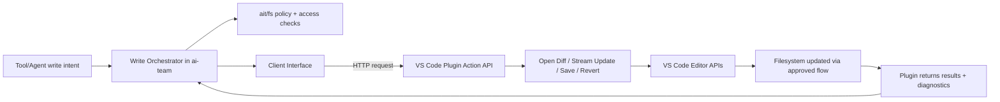
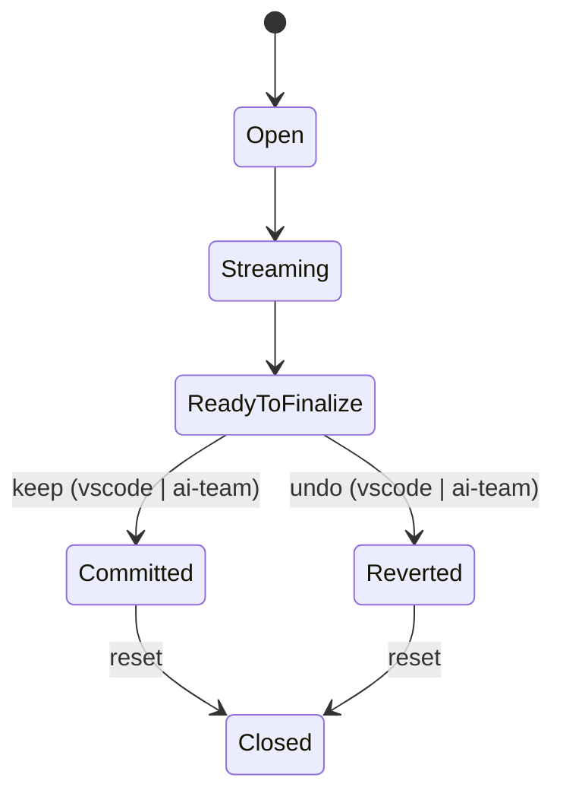

# Integration Plan: Bring Cline-Style Filesystem + Diff UX into AI-Team Architecture

## Objective

Integrate Cline-style editing behavior into your current architecture where:

1. **All write operations go through `ait/fs`** (including access-rights enforcement).
2. **All editor actions are executed by the VS Code plugin API** (not directly by ai-team runtime).
3. **ai-team communicates to the plugin through the existing client HTTP interface**.
4. The plugin evolves from minimal API to a robust diff/edit orchestration layer.

---

## Non-negotiable constraints from your environment

- `ait/fs` remains the source of truth for filesystem access checks and write policy.
- The write tool must not bypass the client→plugin HTTP mechanism.
- VS Code-specific commands (`vscode.diff`, apply edit, save, tab handling) happen inside plugin handlers.
- Plugin API is expected to change and should be versioned.
- `ait/fs` should be extended to authorize and audit `apply_patch` as a first-class operation.
- Operation names across ai-team, `ait/fs`, and plugin APIs should align with Cline semantics.
- The existing `fs_` prefixed tool names in ait are acceptable and can remain canonical model-facing names.
- Avoid duplicate aliases for the same action (e.g., `read_file` + `fs_read_file`) unless mapping is explicit and deterministic.
- Existing functionality must not regress while implementing this plan.
- Every migration phase must be protected by unit tests (and updated tests for changed behavior).

Canonical operation names to adopt:

- `write_to_file`
- `replace_in_file`
- `apply_patch`

If ait keeps `fs_` prefixes, use a stable mapping/crosswalk:

- `fs_read_file` -> `read_file`
- `fs_write_file` -> `write_to_file`
- `fs_replace_in_file` -> `replace_in_file`
- `fs_apply_patch` -> `apply_patch`
- `fs_list_files` -> `list_files`
- `fs_search_files` -> `search_files`

This keeps naming clarity for LLMs while preserving compatibility with Cline-style semantics.

---

## Target architecture blueprint (updated)



---

## Diff storage and revert model (learned from Cline)

The Cline pattern to carry over is:

- capture a stable **original snapshot** before streaming edits,
- stream updates into an editable view,
- compute save/revert from session state,
- always support deterministic cleanup (`revert` then `reset`).

### Proposed snapshot strategy

Store original content in plugin session state rather than only in UI buffers.

- `session.originalContent` (immutable baseline)
- `session.currentContent` (streamed/latest)
- `session.preSaveContent` and `session.postSaveContent` for delta reporting
- `session.fileMetadata` (mtime/hash/encoding/eol) captured at `open-diff`

Use a hybrid storage policy:

- small/medium files: in-memory snapshot
- large files: spill to temp snapshot store with TTL and cleanup job

### Snapshot integrity checks

At `commit` and `revert`, verify baseline consistency:

- compare current file metadata vs `open-diff` metadata,
- if drift is detected, return conflict state and require explicit resolution (`force`, `rebase`, or `abort`).

### Revert mechanism requirements

- `revert` restores `originalContent` for the active session.
- `reset` closes/cleans session resources regardless of result.
- Both operations are idempotent.
- If the file did not exist pre-session (`editType=create`), revert deletes created file and any session-created directories when safe.

---

## Keep/undo model from both VS Code and ai-team

Keep and undo must be triggered from two origins without ambiguity.

### Command origins

- `origin=vscode` when the action comes from plugin UI or VS Code command.
- `origin=ai-team` when the action comes from orchestrator/client API call.

### Canonical operations

- `keep` = finalize/commit current session edits.
- `undo` = revert to original snapshot for current session.

Map these to lifecycle endpoints:

- `keep` -> `/v1/edit/commit`
- `undo` -> `/v1/edit/revert`
- always follow terminal actions with `/v1/edit/reset`.

### Conflict and ordering policy

- Each command includes `sessionId`, `origin`, `seq`, `traceId`.
- Plugin enforces monotonic `seq` per session.
- First terminal action (`commit` or `revert`) wins; subsequent terminal actions return deterministic status (`already_committed` or `already_reverted`).
- Optionally expose `/v1/edit/status` for both clients to reconcile current session state.



---

## API shape to introduce (plugin side)

Use explicit action endpoints (or one endpoint with typed action payloads):

- `POST /v1/edit/open-diff`

  - inputs: `operationId`, `filePath`, `originalContent`, `editType`
  - output: `sessionId`, status

- `POST /v1/edit/update`

  - inputs: `sessionId`, `content`, `isFinal`, optional `changeLocation`
  - output: status, optional rendered metadata

- `POST /v1/edit/scroll-to-first-diff`

  - inputs: `sessionId`

- `POST /v1/edit/commit`

  - inputs: `sessionId`
  - output: `finalContent`, `userEdits`, `autoFormattingEdits`, `newProblems`, `terminalState=committed`

- `POST /v1/edit/revert`

  - inputs: `sessionId`
  - output: `terminalState=reverted`

- `POST /v1/edit/keep`

  - inputs: `sessionId`, `origin`, `seq`
  - behavior: alias to commit for clearer client semantics

- `POST /v1/edit/undo`

  - inputs: `sessionId`, `origin`, `seq`
  - behavior: alias to revert for clearer client semantics

- `POST /v1/edit/reset`

  - inputs: `sessionId`

- `GET /v1/edit/status?sessionId=...`

  - output: current session state (`open|streaming|ready|committed|reverted|closed`), `lastOrigin`, `lastSeq`

Recommendation: include `apiVersion`, `operationId`, and `traceId` in every request for observability.

---

## Phased rollout plan (updated to ai-team)

## Phase 0 — Contract alignment & boundaries (2–3 days)

### Objectives (Phase 0)

- Define exact ownership boundaries among:

  - write tool orchestration,
  - `ait/fs` authorization/write policy,
  - client HTTP transport,
  - plugin action handlers.

### Tasks (Phase 0)

- Create sequence diagrams for successful write, reject, and error recovery.
- Define plugin API v1 payload contracts and response schema.
- Add operation/session IDs shared across ai-team client and plugin logs.
- Create a tool-name alignment matrix (ai-team tool name -> Cline-compatible name).

### Risks and mitigations (Phase 0)

- **Risk:** Hidden ownership overlap (tool and plugin both trying to own write state).

  - **Mitigation:** Single source of truth per concern (policy in `ait/fs`, UI/edit state in plugin).

- **Risk:** Unversioned API causes breaking changes while plugin evolves.

  - **Mitigation:** Introduce `/v1/...` contract and additive evolution rules.

### Acceptance criteria (Phase 0)

- Signed API contract doc.
- One end-to-end dry-run trace from write intent to plugin response.
- Baseline unit tests identified and frozen as non-regression guardrails.

### Checkpoint (Phase 0)

- Architecture sign-off by ai-team + plugin maintainers.

---

## Phase 1 — Integrate write path into `ait/fs` (3–5 days)

### Objectives (Phase 1)

- Ensure every write operation is policy-checked and routed through `ait/fs`.

### Tasks (Phase 1)

- Add `ait/fs` hook in write tool path before any plugin action.
- Enforce path/access checks for create/modify/delete/move.
- Add first-class `apply_patch` authorization path in `ait/fs` (including multi-file/move/delete policy checks).
- Emit normalized write intent object:

  - `operationId`, `path`, `editType`, `proposedContent`, `permissionsResult`.
- Add `operationType` enum aligned with Cline names (`write_to_file`, `replace_in_file`, `apply_patch`).
- Implement ABAC evaluation in `ait/fs` using tuple (`agentId`, `operationType`, `resourcePath`, `workspaceId`, constraints).

### Risks and mitigations (Phase 1)

- **Risk:** Plugin can execute edits that were not authorized by `ait/fs`.

  - **Mitigation:** Require a signed/validated `permissionsResult` token in plugin-bound request.

- **Risk:** Access checks happen too late (after UI operations begin).

  - **Mitigation:** Block at orchestrator before `open-diff` call.

### Acceptance criteria (Phase 1)

- Unauthorized paths never reach plugin actions.
- Authorized writes always carry auditable `operationId` + policy result.
- `apply_patch` requests are policy-checked in `ait/fs` with per-file audit trail.
- Operation naming is consistent across runtime logs, `ait/fs`, and plugin API payloads.
- ABAC policy denials happen before plugin `open-diff` and `update` calls.
- Existing file-operation tests still pass unchanged; new policy branches are covered by unit tests.

### Checkpoint (Phase 1)

- Security and policy review.

---

## Phase 2 — Expand VS Code plugin API from minimal to robust (4–7 days)

### Objectives (Phase 2)

- Implement Cline-like diff/edit lifecycle behind HTTP actions.

### Tasks (Phase 2)

- Implement plugin handlers for:

  - open diff (single file),
  - stream update,
  - save/commit,
  - revert/reset,
  - keep/undo aliases.

- Add virtual left-document provider in plugin (`originalContent` readonly strategy).
- Add multi-file review endpoint (`changes` style) as optional Phase 2.5.
- Return structured results (`finalContent`, `newProblems`, formatting/user deltas).
- Add snapshot persistence policy (in-memory + temp spill) and metadata drift checks.

### Risks and mitigations (Phase 2)

- **Risk:** Plugin state leaks across operations (stale sessions/tabs).

  - **Mitigation:** explicit `sessionId` lifecycle + TTL cleanup.

- **Risk:** Slow editor activation causes open-diff timeouts.

  - **Mitigation:** retry policy + timeout telemetry + fallback error classification.

- **Risk:** newline/BOM normalization drift.

  - **Mitigation:** normalize pre/post-save content before diffing and response.

### Acceptance criteria (Phase 2)

- A full `open → update(stream) → commit` loop works through HTTP only.
- Revert/reset works after user denial and on errors.
- Keep/undo works from both `origin=vscode` and `origin=ai-team`.
- Existing plugin behaviors remain intact and are verified by non-regression unit tests.

### Checkpoint (Phase 2)

- Internal dogfood with large-file and slow-machine scenarios.

---

## Phase 3 — Tool orchestration over HTTP (2–4 days)

### Objectives (Phase 3)

- Replace direct local provider calls with client-interface HTTP calls.

### Tasks (Phase 3)

- Implement orchestration mapping:

  - `open` -> `/edit/open-diff`
  - `update` -> `/edit/update`
  - `saveChanges` or `keep` -> `/edit/commit` (or `/edit/keep`)
  - `undo/revert` -> `/edit/revert` (or `/edit/undo`)
  - `reset` -> `/edit/reset`

- Preserve approval flow semantics (auto/manual approve).
- Preserve internal state flags (`didEditFile` equivalent) in ai-team runtime.
- Add source-aware command routing so both VS Code UI and ai-team can issue terminal actions safely.

### Risks and mitigations (Phase 3)

- **Risk:** Network/request failures leave plugin in half-open session.

  - **Mitigation:** idempotent endpoints + best-effort rollback on client disconnect.

- **Risk:** Out-of-order streaming updates.

  - **Mitigation:** monotonic sequence numbers in update payloads.

- **Risk:** keep/undo races between VS Code and ai-team.

  - **Mitigation:** terminal-state machine with first-terminal-action-wins and explicit status responses.

### Acceptance criteria (Phase 3)

- No direct write-side VS Code API calls outside plugin.
- All write lifecycle operations visible in HTTP traces.
- Legacy tool behaviors are preserved (or explicitly version-gated) and verified by unit tests.

### Checkpoint (Phase 3)

- Integration QA and protocol conformance tests.

---

## Phase 4 — Reliability, observability, and API evolution (2–4 days)

### Objectives (Phase 4)

- Make the new mechanism operable at scale while plugin API evolves safely.

### Tasks (Phase 4)

- Add structured logs/metrics on both sides:

  - open-diff latency,
  - update throughput,
  - commit success/failure,
  - revert/reset frequency,
  - policy denials from `ait/fs`.

- Introduce compatibility matrix (`client version` ↔ `plugin API version`).
- Add smoke tests for backward-compatible schema evolution.

### Risks and mitigations (Phase 4)

- **Risk:** Silent contract drift between client and plugin.

  - **Mitigation:** schema validation + explicit version negotiation.

- **Risk:** Poor root-cause visibility for user-reported failures.

  - **Mitigation:** shared `traceId` across `ait/fs`, client, plugin logs.

### Acceptance criteria (Phase 4)

- Dashboards show clear failure classes and bottlenecks.
- Version mismatch fails fast with actionable error messages.
- CI enforces non-regression test suite pass as a merge requirement.

### Checkpoint (Phase 4)

- Production readiness and rollback plan approval.

---

## Updated implementation checklist (ai-team specific)

- [ ] `ait/fs` checks are mandatory before plugin edit actions.
- [ ] `ait/fs` includes first-class `apply_patch` authorization and auditing.
- [ ] Write tool path emits normalized `operationId` and policy metadata.
- [ ] `operationType` naming aligns with Cline (`write_to_file`, `replace_in_file`, `apply_patch`).
- [ ] Tool-name alignment matrix exists for all integrated Cline tools.
- [ ] Plugin API v1 for edit lifecycle is implemented and documented.
- [ ] Client interface routes all write lifecycle steps over HTTP.
- [ ] Plugin sessions are tracked with `sessionId` and cleaned up deterministically.
- [ ] Original snapshot storage policy is implemented (memory + temp spill) with TTL cleanup.
- [ ] Revert/reset paths are idempotent and tested.
- [ ] Keep/undo can be initiated from VS Code and ai-team with deterministic conflict handling.
- [ ] Newline/BOM normalization tests pass.
- [ ] Telemetry includes shared `traceId` from orchestrator to plugin.
- [ ] Version compatibility checks are enforced at runtime.
- [ ] Non-regression unit tests cover existing functionality before and after each migration step.
- [ ] CI blocks merges when unit tests fail.

---

## Tool renaming/integration scope recommendation

Integrate tools in waves, but keep names Cline-compatible from day one.

If you retain `fs_` names as canonical in ait, that is still fine for LLM behavior as long as:

- names are consistent,
- each action has one canonical tool name,
- any compatibility mapping is centralized and documented.

### Wave 1 (filesystem + diff critical)

- `read_file`
- `write_to_file`
- `replace_in_file`
- `apply_patch`
- `list_files`
- `search_files`
- `list_code_definition_names`

### Wave 2 (execution and web)

- `execute_command`
- `browser_action`
- `web_fetch`
- `web_search`

### Wave 3 (orchestration and advanced)

- `new_task`
- `plan_mode_respond`
- `act_mode_respond`
- `summarize_task`
- `use_skill`
- `use_subagents`

Each integrated tool should declare:

- `operationType` (Cline-compatible name)
- whether it is read-only or mutating
- required ABAC attributes in `ait/fs`

---

## Reference implementation documentation

Use the following file as the primary reference for how Cline actually implements write, notification, diff, and VS Code behavior:

- `analysis documents/cline-vscode-filesystem-diff-findings.md`

That document should be treated as the behavior baseline when implementing and reviewing ai-team parity.

---

## ABAC policy checklist for `ait/fs`

Use this checklist as a release gate for filesystem-related tool operations.

### Core policy checks (all file tools)

- [ ] Resolve and normalize all paths before policy evaluation.
- [ ] Evaluate ABAC with tuple: `agentId`, `operationType`, `resourcePath`, `workspaceId`, constraints.
- [ ] Deny before any plugin-side side effects (`open-diff`, `update`, temp artifacts).
- [ ] Emit structured audit event for both allow and deny decisions.
- [ ] Return deterministic deny reason codes (machine-readable + user-safe message).

### Operation-specific checks

- [ ] `read_file`: require read scope on resolved path.
- [ ] `write_to_file`: require write/create scope and parent directory permission.
- [ ] `replace_in_file`: require modify scope on existing file.
- [ ] `apply_patch`: evaluate every file action in patch:
  - add/create,
  - update/modify,
  - delete,
  - move (must authorize source and destination).
- [ ] Reject full patch when any required permission is missing (or enforce explicit partial-policy mode).

### Safety and consistency checks

- [ ] Protect system/blocked paths with hard deny list.
- [ ] Enforce workspace boundary policy.
- [ ] Enforce idempotent behavior for terminal operations (keep/undo/reset).
- [ ] Keep operation naming aligned with Cline (`write_to_file`, `replace_in_file`, `apply_patch`).

### Example allow/deny outputs

- **Allow**: `ALLOW(agent=frontend-fixer, op=replace_in_file, path=src/components/Button.tsx)`
- **Deny**: `DENY(agent=frontend-fixer, op=apply_patch, path=infra/terraform/main.tf, reason=scope_mismatch)`

---

## Failed tool-call handoff protocol (user-approved)

Your requirement: when a tool call is denied/failed by policy, ait must indicate which agent(s) are allowed so a handoff can be proposed and approved by the user.

### Required behavior

1. `ait/fs` returns a deny object with:
   - `operationId`
   - `agentId` (caller)
   - `operationType`
   - `resourcePath` (or paths)
   - `reasonCode`
   - `allowedAgents` (ordered recommendations)
   - `policyEvidence` (safe, non-secret explanation)
2. Orchestrator presents a handoff proposal to the user.
3. Handoff is executed only after explicit user approval.
4. Approved handoff replays the blocked operation with the selected agent under a new `operationId` linked to original.

### Response contract recommendation

```json
{
  "allowed": false,
  "operationId": "op_123",
  "agentId": "frontend-fixer",
  "operationType": "apply_patch",
  "reasonCode": "scope_mismatch",
  "resourcePaths": ["infra/terraform/main.tf"],
  "allowedAgents": [
    {
      "agentId": "infra-agent",
      "confidence": 0.93,
      "reason": "Agent has terraform_write scope in this workspace"
    }
  ],
  "handoff": {
    "possible": true,
    "requiresUserApproval": true
  }
}
```

### UX recommendation

- Show concise deny reason.
- Show top recommended allowed agent.
- Offer actions:
  - `Propose handoff`
  - `Choose another allowed agent`
  - `Cancel`
- Never auto-handoff without user confirmation.

### Audit requirements

- Log original denied operation.
- Log user handoff decision.
- Log delegated execution result.
- Link all records by `parentOperationId` for traceability.

---

## Minimal orchestration template (through your mechanism)

```ts
const auth = await aitFs.authorizeWrite({ path, operationId, editType })
if (!auth.allowed) return deny(auth.reason)

const session = await pluginClient.post("/v1/edit/open-diff", {
  operationId,
  filePath: path,
  originalContent,
  editType,
  permissionsResult: auth.token,
})

for await (const chunk of contentStream) {
  await pluginClient.post("/v1/edit/update", {
    operationId,
    sessionId: session.sessionId,
    content: chunk.accumulated,
    isFinal: chunk.isFinal,
    seq: chunk.seq,
  })
}

const terminalAction = approvedByUser ? "keep" : "undo"

if (terminalAction === "keep") {
  const result = await pluginClient.post("/v1/edit/keep", {
    operationId,
    sessionId: session.sessionId,
    origin: "ai-team",
    seq: nextSeq(),
  })
  markFileEdited(path)
} else {
  await pluginClient.post("/v1/edit/undo", {
    operationId,
    sessionId: session.sessionId,
    origin: "ai-team",
    seq: nextSeq(),
  })
}

await pluginClient.post("/v1/edit/reset", { operationId, sessionId: session.sessionId })
```

---

## Minimum non-regression test matrix (required)

Use this matrix as the baseline unit-test gate for each migration PR.

### Filesystem tools

| Tool / operation | Must keep working | Required unit tests |
| --- | --- | --- |
| `read_file` | Reads permitted paths exactly as before | allow path, deny path, normalized path resolution, stable output format |
| `list_files` | Lists permitted directories with existing filters | allow dir, deny dir, ignore/exclude behavior, pagination/limit behavior |
| `search_files` | Search semantics unchanged for allowed scope | allow search, deny scope, result truncation behavior, encoding edge case |
| `write_to_file` | Full-file create/overwrite behavior unchanged | create new file, overwrite existing file, deny before side effects, rollback on reject |
| `replace_in_file` | Targeted replacement behavior unchanged | exact replace, partial mismatch handling, deny before side effects, newline/BOM preservation |
| `apply_patch` | Multi-file patch behavior unchanged | add/update/delete/move actions, per-file ABAC checks, all-or-nothing policy behavior, deterministic rollback |

### Diff/session behavior

| Behavior area | Must keep working | Required unit tests |
| --- | --- | --- |
| Open/update/commit lifecycle | Session lifecycle remains deterministic | open session, ordered updates, final commit, double-commit idempotency |
| Keep/undo from both origins | VS Code and ai-team can finalize safely | keep(vscode), keep(ai-team), undo(vscode), undo(ai-team), first-terminal-action-wins |
| Reset/cleanup | No stale session artifacts | reset after commit, reset after undo, reset after error/timeout |
| Original snapshot integrity | Baseline remains stable | baseline capture, metadata drift detection, conflict response correctness |

### Access control and handoff

| Policy area | Must keep working | Required unit tests |
| --- | --- | --- |
| ABAC enforcement timing | Deny before plugin side effects | deny path does not call open-diff/update, allow path does |
| Deny response contract | Handoff info always present when possible | includes `reasonCode`, ordered `allowedAgents`, `requiresUserApproval` |
| User-approved handoff flow | No auto-delegation | proposal required, approve path delegates, reject path does not delegate |
| Audit trail continuity | Traceability preserved | deny record, handoff decision record, delegated execution record linked by parentOperationId |

### CI gate rules

- Every PR touching tool execution, `ait/fs` policy, or plugin API must run this matrix.
- Merges are blocked on any failing non-regression test.
- Intentional behavior changes require explicit test updates and changelog note in the PR description.

---

## Rollout strategy suggestion (for your setup)

1. Implement plugin API v1 behind feature flag `http_edit_lifecycle`.
2. Route one write tool (e.g., `write_to_file`) through new path first.
3. Dogfood with ai-team internally for 1–2 weeks.
4. Expand to `replace_in_file` and patch workflows.
5. Remove legacy direct path only after error budget remains stable.

---

## Definition of done

Integration is complete when:

- Every write is authorized via `ait/fs` and executed through client→plugin HTTP flow.
- Users consistently see accurate diffs and reliable approve/reject behavior.
- Plugin API supports robust lifecycle operations (`open/update/commit/revert/reset`).
- Original snapshot + revert behavior is deterministic and resilient to race/conflict conditions.
- Keep/undo works safely from both VS Code and ai-team origins.
- Versioning + observability prevent silent regressions as plugin evolves.
- Existing functionality remains intact, proven by passing non-regression unit tests in CI.
