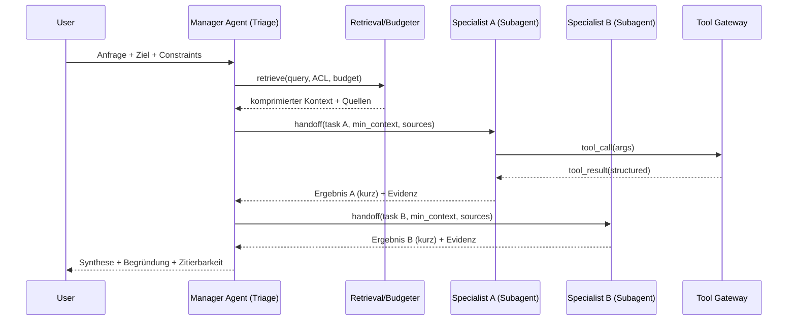
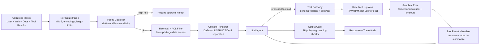

# Kontextfokussierung und Kontextlimitierung in LLM‑Systemen mit Skills, Agents, Subagents und Workflows

## Executive Summary

„Kontext“ ist in modernen LLM‑Systemen weniger ein einzelner Prompt‑Text als ein **kontrollierter Ressourcenfluss**: Welche Informationen (Dokumente, Memory, Tool‑Outputs), welche Handlungsoptionen (Tools/Actions) und welche Policies (Zugriff, Safety) das Modell *situativ* erhält. Praktisch bedeutet Kontextfokussierung daher: **Kontextbudgetierung** (Token/Latency/Cost), **Kontextselektion** (nur relevante, autorisierte, vertrauenswürdige Inhalte) und **Kontextisolierung** (untrusted content darf keine Privilegien eskalieren). Diese Perspektive ist konsistent mit aktuellen Plattform‑Guides zu Tool‑Use, Compaction/Prompt‑Caching und Agent‑Sicherheit. citeturn16search6turn10search8turn15search1turn16search3

Die Begriffe **Tools, Skills/Plugins, Agents, Subagents/Handoffs, Workflows und Memory** sind nicht nur Terminologie, sondern definieren **Sicherheits‑ und Zuständigkeitsgrenzen**. In verbreiteten Frameworks gilt:  
- *Tools* sind deterministische Funktionen/Schnittstellen (mit Schemas und Gateways), die externe Daten/Aktionen liefern. citeturn10search4turn10search0turn11search8  
- *Skills (OpenAI)* bzw. *Plugins (Semantic Kernel)* bündeln wiederverwendbare, versionierte Ressourcen/Funktionen und begrenzen damit explizit „was der Agent kann“. citeturn16search0turn16search4turn13search0turn13search7  
- *Agents* sind dynamische Schleifen („Model entscheidet iterativ über Tool‑Nutzung bis Stop/Limit“). citeturn11search11turn16search11  
- *Subagents/Handoffs* sind Spezialisierungen mit kontrollierter Übergabe (Handoff als Tool). citeturn16search1turn16search7  
- *Workflows* sind deterministische oder graph‑basierte Control‑Flows (Pipelines/Graphs/Events), die Kontextflüsse *by construction* minimieren. citeturn11search0turn11search1turn11search2  
- *Memory* ist mehrschichtig (Session‑History, persistentes Langzeit‑Memory, nicht‑parametrischer Wissensspeicher in RAG) und muss wie ein Datenprodukt betrieben werden (Retention, Zugriff, Löschung). citeturn16search2turn12search1turn14search2turn14search3  

Selbst bei sehr großen Context Windows bleibt Kontextfokussierung entscheidend: GPT‑4.1 wird mit ~1,05M Token Context Window dokumentiert; Claude Sonnet 4.6 nennt 1M Token (Beta); Llama 4 Scout weist in der Modellkarte 10M Kontextlänge aus. citeturn6view2turn0search1turn8search2 Forschung zeigt zudem, dass Modelle Informationen in langen Kontexten positionsabhängig schlechter nutzen („Lost in the Middle“). citeturn15search0 Daher bleiben RAG, Chunking/Reranking, Summarisierung/Compaction, Caching und hierarchische Memory‑Architekturen Kernbausteine. citeturn14search2turn10search8turn15search1turn14search3

Sicherheit ist ein **Strukturproblem**, kein Prompt‑Problem: Prompt Injection wird von britischen und industriellen Leitlinien ausdrücklich nicht als „SQL‑Injection‑Analog“ betrachtet; stattdessen sollte man Systeme so bauen, dass kompromittierter Modelloutput keine weitreichenden Aktionen auslösen kann (Least Privilege, Tool‑Gateways, Sandboxing, Rate Limits, Guardrails, Audits). citeturn4search0turn16search3turn3search3 Ein aktuelles Praxisbeispiel ist CVE‑2026‑25592: eine Arbitrary‑File‑Write‑Schwachstelle in einem Agent‑SDK‑Kontext (Semantic Kernel .NET, SessionsPythonPlugin), mit empfohlenen Mitigations über Invocation‑Filter/Allowlisting. citeturn5search1turn13search2turn13search1

Im Betrieb wird Qualität durch **komponentenweise Evaluation** abgesichert: Retrieval‑Qualität, Groundedness/Faithfulness, Tool‑Erfolgsraten, Kosten/Latenz sowie Failure‑Modes (Injection‑Erfolgsrate, Tool‑Loops). Für RAG‑Pipelines sind RAGAS (EACL Demo) und Tracing/Evals‑Stacks (z. B. TruLens, Promptfoo) weit verbreitet. citeturn17search0turn3search1turn3search12

*(Einordnung der Quellenpräferenz: Der Bericht stützt sich u. a. auf entity["company","OpenAI","ai research company"], entity["company","Anthropic","ai safety company"], entity["company","Meta","technology company"], entity["company","Microsoft","technology company"], entity["company","Amazon Web Services","cloud provider"], entity["company","Google Cloud","cloud provider"] sowie entity["organization","Bundesamt für Sicherheit in der Informationstechnik","german cybersecurity agency"], entity["organization","National Institute of Standards and Technology","us standards agency"], entity["organization","OWASP","web security nonprofit"], entity["organization","ENISA","eu cybersecurity agency"], entity["organization","National Cyber Security Centre","uk cybersecurity center"] und entity["organization","Datenschutzkonferenz","german dp authority group"].)*

## Definitionen und Abgrenzungen

Die Begriffe überlappen in der Praxis; für Architekturentscheidungen ist eine **präzise Abgrenzung nach Control‑Flow, Kontextzugriff und Privilegien** hilfreich.

### Abgrenzungsmatrix

| Konzept | Kurzdefinition | Control‑Flow | Kontextwirkung | Sicherheitsrelevante Grenze |
|---|---|---|---|---|
| Tool | Aufrufbare Funktion/Schnittstelle mit definierten Inputs/Outputs; Modell erzeugt Tool‑Call, App führt deterministisch aus. | i. d. R. synchron/async pro Call | Kontext wird „just‑in‑time“ beschafft; Tokenverbrauch steuerbar durch Tool‑Output‑Formate. | Tool‑Gateway (AuthZ, Validierung, Quotas, Sandbox). |
| Tool‑use (Tool calling) | Muster/Protokoll, wie ein Modell Tools auswählt und aufruft (Schemas, tool calls, tool results). | häufig Agent‑Loop oder Workflow‑Step | reduziert „alles in Prompt“; ermöglicht Kontext aus externen Quellen. | Verwechslung von Daten/Instruktionen → Injection‑Risiko am Input/Tool‑Result. |
| Skill (OpenAI) | Wiederverwendbares, versioniertes Bundle (Instruktionen + Scripts + Assets) mit Manifest (SKILL.md), das in Shell/Container gelesen/ausgeführt werden kann. | als Erweiterung von Tool‑Umgebungen (z. B. Shell) | verlagert Kontext in „paketierte Artefakte“ statt Prompt‑Text; erlaubt Kompilation/Tests. | Supply‑Chain und Execution‑Isolation der Skill‑Umgebung. |
| Plugin (Semantic Kernel) | Bündel von Funktionen (Prompt‑ oder Code‑Funktionen), als Plugin repräsentiert; „skills“ wurden in SK → „plugins“ überführt. | Kernel orchestriert Funktionsauswahl/Invocation | reduziert kognitive/Prompt‑Komplexität durch Kapselung; Tool‑ähnlich. | Filters/Invocation‑Kontrollen als zentrale Safety‑Hooks. |
| Agent | Dynamisches System, das iterativ reasoned, Tools auswählt und bis Stop/Iteration‑Limit arbeitet. | Schleife (loop) mit Stop‑Bedingungen | Kontext wächst/ändert sich pro Iteration durch Results; braucht Budgetierung/Trimming. | „Excessive agency“, Tool‑Loops, unbounded cost/latency. |
| Subagent / Handoff | Spezialisierter Agent; Übergabe (Handoff) wird als Tool modelliert. | Hierarchie/Delegation | reduziert Kontext durch Spezialisierung; „minimale Übergabe“ möglich. | Übergabe‑Payload ist Security‑/Privacy‑Boundary. |
| Workflow / Pipeline / Graph | Schrittweise Ausführung mit (teil‑)deterministischem Pfad; Graphs erlauben Branches/Loops über Knoten/Edges/Events. | deterministisch/graph‑basiert | Kontext pro Schritt minimierbar („only what you need“) | Policy‑Gates pro Knoten; einfacher zu testen als freie Agent‑Loops. |
| Memory | Zustands- und Wissenshaltung (Session‑History, Langzeit‑Memory, Memory‑Strategies) außerhalb des aktuellen Prompts. | asynchron/persistiert | erweitert Kontext über Fenster hinaus; erfordert Auswahl/Kompression beim Re‑Insert. | Datenhaltung/Retention/ACL; Privacy by Design. |

**Quellenhinweise:** Tool‑Use/Function‑Calling und die tool‑basierte Systematik sind in OpenAI‑Guides beschrieben; LangChain dokumentiert Tools als callable Funktionen, deren Invocation der Model‑Kontext steuert. citeturn10search4turn10search0turn11search8 Skills (OpenAI) werden als versionierte Bundles mit SKILL.md‑Manifest definiert; Semantic Kernel erläutert Plugins sowie den Übergang „skills → plugins“. citeturn16search4turn16search0turn13search0turn13search7 Agent‑Loops (Stop/Iteration‑Limit) dokumentiert LangChain explizit; das Agents SDK beschreibt agentische Apps inkl. Handoffs/Tracing. citeturn11search11turn16search11 Workflows/Pipelines werden als event‑getrieben (LlamaIndex) bzw. directed multigraphs (Haystack) beschrieben; LangGraph grenzt Workflows (vordefiniert) gegenüber Agents (dynamisch) ab. citeturn11search1turn11search2turn11search0 Memory als Produkt (Session vs Langzeit, Retention) wird bei Bedrock Agents und im Agents SDK dokumentiert; hierarchische/virtuelle Memory‑Modelle werden in MemGPT als Paging‑/Tier‑Konzept beschrieben. citeturn12search1turn16search2turn14search3

## Architektur- und Designmuster

Kontextfokussierung gelingt stabil, wenn sie in **Architekturbausteine** übersetzt wird (Gates, Router, Budgeter, Orchestrator) statt in monolithische Prompts.

### Musterfamilien und ihre Kontextlogik

**ReAct‑Orchestrierung (Reason + Act)**: Interleaving von reasoning traces und actions erlaubt „Kontext holen wenn nötig“ und kann Halluzinationen/Fehlerfortpflanzung reduzieren, weil externe Quellen aktiv konsultiert werden. citeturn14search0turn12search0

**MRKL/Router‑Pattern (modulare Experimente)**: Ein LLM wird als Router/Controller genutzt, der spezialisierte Module (Retriever, Rechner, Wissensquellen) selektiert. Das „Kontextfenster“ enthält dann primär **Ergebnisse der Module**, nicht die gesamte Weltbeschreibung. citeturn14search1turn14search2

**Workflow‑first, Agent‑fallback**: LangGraph formuliert Workflows als vordefinierte Codepfade und Agents als dynamische Prozesse. In der Praxis ist dies ein Kosten‑/Sicherheitshebel: Wo Pfade bekannt sind, sind Workflows reproduzierbarer, besser testbar und leichter zu härten. citeturn11search0

**Graph‑Orchestrierung und Event‑Driven Steps**:  
- LlamaIndex: Workflows als Handler‑Ketten über Events (leichtgewichtige Abstraktion). citeturn11search1turn11search4  
- Haystack: Pipelines als directed multigraphs mit parallelen Flüssen/Loops. citeturn11search2  
Graphen erzwingen Kontextfokus, weil jeder Knoten nur seine Inputs erhält.

**Kontext‑Engineering‑Stack / Kontextlayer**: Google beschreibt „context engineering“ explizit als Disziplin und führt in ADK konfigurierbare Kontextlayer (Static/Turn/User/Cache) zur Tokenreduktion und Steuerung ein. citeturn12search23turn12search17

### Referenzarchitektur als Flussdiagramm

```mermaid
flowchart TD
  U[User Input] --> IG[Ingress Gate\n- AuthN/AuthZ\n- Risk/Policy Klassifikation]
  IG -->|allowed| R[Context Router\n(Skill/Tool/Workflow Auswahl)]
  IG -->|blocked| REF[Refuse / Safe Completion]

  R --> W[Workflow/Graph Orchestrator]
  W --> RET[Retrieval Step\n(Vector/Keyword/Hybrid + ACL Filter)]
  RET --> B[Context Budgeter\n(select + compress + cite)]
  B --> A[Agent/LLM Step\n(tool calling / structured output)]

  A -->|tool call| TG[Tool Gateway\n- allowlist\n- schema validation\n- rate limits\n- sandbox]
  TG --> EXT[External Systems\n(DB/APIs/FS/Search)]
  EXT --> TG --> A

  A --> OG[Output Gate\n- grounding checks\n- PII/Policy\n- citation/provenance]
  OG --> OUT[Final Answer]
```

**Warum dieses Muster breit genutzt wird:**  
- Es trennt *untrusted data* (User/Docs/Web) strikt von *control* (Policies, Tool‑Allowlists). citeturn4search0turn16search3  
- Es operationalisiert Context‑Management‑Mechanismen wie Compaction und Prompt Caching an dedizierten Stellen (Budgeter/Cache‑Layer). citeturn10search8turn15search1  
- Es passt zu Agent‑SDK‑Primitiven (Tools, Handoffs, Guardrails, Tracing) und zu Workflow‑Engines. citeturn16search11turn16search1turn10search12turn10search1turn11search0

## Orchestrierung und Kommunikation zwischen Subkomponenten

Orchestrierung ist die Stelle, an der Kontext tatsächlich „klein“ bleibt: sie entscheidet, welche Subkomponente welchen Ausschnitt des Zustands sieht.

### Kommunikationsmodelle

**Funktionsaufruf‑basiert (Tool calling)**: Modell erzeugt Tool‑Call mit Argumenten; Anwendung führt aus und liefert Ergebnis zurück. Das ist explizit in Tool‑Calling‑Guides als Kernmechanismus beschrieben. citeturn10search4turn16search6

**Event‑Driven (Workflows)**: Zustandsübergänge werden als Events/Steps modelliert (LlamaIndex), was natürlicherweise zu kleineren, typisierten Payloads führt (statt „alles als Prompttext“). citeturn11search1turn11search4

**Graph/Pipeline‑Execution**: Directed multigraphs erlauben parallele Flüsse und Loops; gleichzeitig zwingt die Knoten‑Schnittstelle zur expliziten Datenübergabe (guter Hebel gegen Kontext‑Drift). citeturn11search2

**Multi‑Agent Delegation (Handoffs)**: Handoffs werden im Agents SDK explizit als Tool repräsentiert; damit werden Delegationen auditable und mit denselben Sicherheitsmechanismen behandelbar wie Tool Calls. citeturn16search1turn16search7

### Sequenzdiagramm: Manager–Worker mit minimalem Übergabekontext



**Warum „min_context“ entscheidend ist:** Es reduziert Tokenkosten/Latenz, verhindert unnötige Datenexposition und begrenzt die Angriffsfläche für indirekte Prompt‑Injection (z. B. über Retrieval‑Dokumente). Die Grundidee, dass Prompt Injection als „confused deputy“ zu behandeln ist und man Impact begrenzen muss, wird von NCSC betont; OpenAI beschreibt Prompt Injections explizit als riskant, insbesondere wenn downstream Tools existieren. citeturn4search0turn16search3

### Tracing & Zustandsverwaltung als Orchestrierungs‑Backbone

Breit genutzte Agent‑Systeme integrieren Tracing und Session‑State als First‑Class Konzepte:  
- Sessions halten Konversationshistorie automatisch über Runs hinweg. citeturn16search2  
- Tracing zeichnet Tool Calls, Handoffs, Guardrails und Generations auf. citeturn10search1  
Diese Observability ist nicht nur Debugging‑Komfort, sondern Voraussetzung für **komponentenbasierte Evaluation** (z. B. „warum wurde dieses Dokument gewählt?“) und für Security‑Audits (z. B. „wer hat welches Tool wann mit welchen Parametern aufgerufen?“). citeturn10search1turn3search1

## Kontextlimitierungstechniken

Kontextlimitierung ist ein Methodenset, das sich nach (a) Aufgabenklasse, (b) Kosten/Latenz‑Budget, (c) Sicherheitsanforderungen und (d) Governance (Nachvollziehbarkeit/Provenienz) richtet.

### Vergleichstabelle: Techniken zur Kontextbegrenzung und -fokussierung

| Technik | Primärziel | Typischer Einsatz | Stärken | Typische Failure Modes |
|---|---|---|---|---|
| Chunking | Dokumente in retrievalfähige Einheiten splitten | RAG‑Indexierung, PDF/KB‑Ingestion | bessere Retrieval‑Granularität | schlechte Chunk‑Grenzen → Kontextlücken; zu viel Overlap → Redundanz |
| RAG (Retrieve‑then‑Generate) | nur relevante Passagen in Prompt bringen | Q&A, Enterprise Search, Fachassistenz | Aktualität, Zitierbarkeit, geringere Halluzination | Retrieval‑Drift; ACL‑Fehler; indirekte Prompt‑Injection über Dokumente |
| Reranking/Filtering | Präzision von Top‑k erhöhen | RAG‑Pipelines | weniger irrelevanter Kontext | zusätzliche Latenz; Over‑Filtering |
| Summarization/Compaction | Langläufe stabil und günstig halten | Agent‑Sessions, lange Dialoge | Tokenreduktion; bessere Kontinuität | Summary‑Drift; Informationsverlust |
| Prompt/Context Caching | Kosten/Latenz bei wiederholten Prefixen senken | stabile Systemprompts, gemeinsame Kontexte | bis zu große Latency-/Cost‑Reduktion (anbieterabhängig) | Cache‑Staleness; falsche Isolation |
| Hierarchisches Memory | „unbounded context“ durch Tiers/Paging | Langzeitassistenten, Dokumentanalyse | skaliert über Context Window hinaus | Komplexität; Privacy/Retention; Debuggability |

**Quellenhinweise:** RAG wird als Kombination parametric + non‑parametric memory beschrieben. citeturn14search2 Compaction wird als Technik zur Reduktion des Kontexts bei langen Interaktionen dokumentiert. citeturn10search8 Prompt Caching wird bei OpenAI als automatische Optimierung mit großen potenziellen Latency-/Cost‑Effekten dokumentiert; Anthropic beschreibt Prompt Caching inkl. Isolation‑Details; Google beschreibt Context Caching inkl. Security‑Features wie CMEK. citeturn15search1turn15search3turn12search20 Hierarchisches Memory im Sinne virtuellen Kontextmanagements wird in MemGPT als OS‑analoge Tier‑Strategie beschrieben. citeturn14search3

### Große Context Windows: Vergleich GPT‑4 / Claude / Llama‑Familie

| Familie (Beispiele) | Dokumentierte Kontextlänge | Relevanz für Kontextfokussierung |
|---|---:|---|
| GPT‑4 (Beispiel GPT‑4.1) | 1,047,576 Tokens Context Window | erleichtert Long‑Context‑Workloads, ersetzt aber nicht Budgetierung/Selektion. citeturn6view2 |
| Claude (Beispiel Sonnet 4.6) | 1M Tokens (Beta) | gut für große Projekte/Dokumente; Tool‑Use‑Optimierungen zielen auf weniger Round‑Trips/Tokens. citeturn0search1turn10search2 |
| Llama‑Familie (Beispiel Llama 4 Scout) | 10M Tokens Context Length (Modellkarte) | extrem lange Inputs möglich, aber Long‑Context‑Qualität ist nicht automatisch robust (siehe „Lost in the Middle“). citeturn8search2turn15search0 |

**Wichtiges Forschungsergebnis:** „Lost in the Middle“ zeigt, dass die Leistung bei Long Context stark davon abhängen kann, *wo* relevante Information im Kontext steht (Anfang/Ende besser als Mitte). Das ist ein starkes Argument, auch bei großen Fenstern weiterhin Retrieval‑Selektion, Reordering und Kompression einzusetzen. citeturn15search0

### Kontextmanagement in laufenden Agents: Skills, Compaction und „Tool‑seitige Vorverarbeitung“

OpenAI dokumentiert Skills als versionierte Bundles, die insbesondere in Shell‑/Containerumgebungen wiederverwendbar sind; ein begleitender Blog beschreibt konkrete Long‑Running‑Patterns („Shell + Skills + Compaction“). citeturn16search0turn10search11 Anthropic beschreibt programmatic tool calling: Claude kann Tool‑Orchestrierungscode in einer Code‑Execution‑Umgebung schreiben, um Tool‑Round‑Trips zu reduzieren und Daten zu filtern, bevor sie als Tokens in den Modellkontext gelangen. citeturn10search2turn10search6 Diese Mechanismen sind praktisch „Kontextlimitierung durch Vorverarbeitung“: weniger Tokens, weniger Zwischenantworten, kleinerer Angriffsraum.

## Sicherheit, Robustheit und Governance

Kontextfokussierung und Sicherheit sind gekoppelt: Jede zusätzliche Kontextquelle (Web, Files, Tools, Memory) ist eine potenzielle **Policy‑Bypass‑Route**.

### Prompt Injection: Warum „Impact‑Minimierung“ zentral ist

NCSC argumentiert, Prompt Injection dürfe nicht wie SQL‑Injection missverstanden werden, weil LLMs Daten und Instruktionen nicht zuverlässig trennen; daraus folgt eine „confused deputy“‑Sicht: Systeme müssen so gebaut werden, dass selbst erfolgreiche Injections *nicht* zu unautorisierten Aktionen/Datenabflüssen führen. citeturn4search0turn4search4 OpenAI beschreibt Prompt Injections im Agent‑Builder‑Safety‑Guide explizit als Angriff, bei dem untrusted Text versucht, Instruktionen zu überschreiben, u. a. mit Zielen wie Exfiltration via Tool Calls. citeturn16search3 OWASP listet Prompt Injection als LLM01 und betont angrenzende Risiken wie Insecure Output Handling, DoS und Supply‑Chain‑Vulnerabilities. citeturn3search3turn3search7

### Sicherheits‑Flow als Mermaid‑Diagramm



**Quellenhinweise:** Rate Limits sind als expliziter API‑Mechanismus dokumentiert; OpenAI beschreibt Safety‑Best‑Practices wie Input‑Constraining/Token‑Limits; Microsoft dokumentiert Invocation‑Filter als Hook‑Mechanismus, der Funktionsaufrufe intercepten kann. citeturn15search2turn16search9turn13search1

### Vergleichstabelle: Sicherheitsmaßnahmen entlang der LLM‑Kette

| Maßnahme | Wogegen primär | Wo implementieren | Anforderungen / Hinweise |
|---|---|---|---|
| Eingabe‑Constraints (Längen, erlaubte Felder) | Prompt Injection, DoS | Ingress Gate | OpenAI empfiehlt u. a. das Eingrenzen von User‑Inputs und Output‑Tokens. citeturn16search9 |
| ACL‑Filtering vor Retrieval | Data Leakage, Unauthorized context | Retrieval Layer | DSK‑Orientierungshilfen zu RAG betonen DSGVO‑Prinzipien/Grundsätze auch bei RAG‑Komponenten. citeturn4search3turn4search11 |
| Tool‑Allowlisting + Schema‑Validierung | Insecure tool calls, RCE/File write | Tool Gateway | Function calling basiert auf JSON‑Schema‑Definitionen; Gateways müssen zusätzlich eigene Validierung erzwingen. citeturn10search4turn10search0 |
| Rate limiting / Quotas | Kostenexplosion, Tool‑Storms, DoS | Gateway/Orchestrator | Rate Limits sind als Plattform‑Mechanismus dokumentiert; zusätzlich oft app‑seitige Token‑Buckets nötig. citeturn15search2 |
| Sandboxing (FS/Net/CPU) | Escalation durch Tool‑Execution | Tool Exec | Besonders relevant bei Shell/Code‑Execution‑Tools und bei Skills/Plugins. citeturn16search0turn10search2 |
| Invocation/Policy Filters | Missbrauch einzelner Funktionen | Tool/Plugin Framework | Semantic Kernel dokumentiert Function Invocation Filters; CVE‑Mitigations verweisen auf Allowlisting dieser Argumente. citeturn13search1turn5search1turn13search2 |
| Tracing + Audit | Forensik, Debugging, Governance | Plattform/SDK | Agents SDK beschreibt umfassendes Tracing (LLM, tools, handoffs, guardrails). citeturn10search1 |

### Praxisbeispiel: CVE‑2026‑25592 als „Tool‑Gateway‑Lehrstück“

NVD beschreibt CVE‑2026‑25592 als Arbitrary File Write in Microsofts Semantic Kernel .NET SDK (SessionsPythonPlugin) mit Fix in bestimmten Versionen; GitHub Advisory konkretisiert Impact und Betroffene; Microsoft dokumentiert Invocation Filters als Interception‑Mechanismus. citeturn5search1turn13search2turn13search1 Das Muster ist generalisierbar: **Tool‑Argumente sind untrusted input**, auch wenn sie „vom Modell“ kommen. Tool‑Gateways müssen daher Pfade/URLs/Queries strikt erlaublisten und isoliert ausführen.

### Governance‑Rahmen: NIST, BSI, ENISA, DSK

- NIST AI RMF 1.0 positioniert Risikomanagement über den Lebenszyklus; ergänzend existiert ein NIST Profile für Generative AI als Companion‑Ressource. citeturn5search0turn5search7  
- BSI veröffentlicht Kriterienkataloge für den sicheren Einsatz generativer KI‑Modelle in der Bundesverwaltung. citeturn4search2turn4search6  
- ENISA Threat Landscape 2025 zeigt die zunehmende Rolle von KI in der Bedrohungslandschaft (u. a. AI‑unterstützte Social‑Engineering‑Aktivitäten). citeturn4search1turn4search17  
- DSK liefert Orientierungshilfen zu Datenschutzanforderungen an KI‑Systeme sowie spezifisch zu RAG‑Systemen. citeturn4search7turn4search11turn4search3  
Diese Dokumente stützen die Empfehlung, Kontext‑/Memory‑Komponenten als **Datenverarbeitungssysteme** zu behandeln (Zugriff, Protokollierung, Retention, Löschung).

### Code‑Snippet: Plattformagnostisches Tool‑Gateway (Allowlist, Schema, Rate Limit, Sandbox‑Hook)

```python
from __future__ import annotations

import json
import time
from dataclasses import dataclass
from typing import Any, Callable, Dict, Optional, Tuple

try:
    from pydantic import BaseModel, ValidationError, Field
except ImportError:  # keep snippet runnable without hard dependency
    BaseModel = object  # type: ignore
    ValidationError = Exception  # type: ignore
    Field = lambda *a, **k: None  # type: ignore

# --- Example tool schemas (Pydantic) -----------------------------------------

class WeatherArgs(BaseModel):
    city: str = Field(min_length=1, max_length=120)
    units: str = Field(default="metric", pattern="^(metric|imperial)$")

class FileWriteArgs(BaseModel):
    # A deliberately strict schema: no relative paths, no traversal, no arbitrary dirs
    allowed_path: str = Field(min_length=1, max_length=240)
    content: str = Field(min_length=0, max_length=50_000)

# --- Rate limiter (token bucket) ---------------------------------------------

@dataclass
class TokenBucket:
    capacity: int
    refill_per_sec: float
    tokens: float
    last: float

    @classmethod
    def new(cls, capacity: int, refill_per_sec: float) -> "TokenBucket":
        now = time.time()
        return cls(capacity=capacity, refill_per_sec=refill_per_sec,
                   tokens=float(capacity), last=now)

    def allow(self, cost: int = 1) -> bool:
        now = time.time()
        elapsed = now - self.last
        self.tokens = min(self.capacity, self.tokens + elapsed * self.refill_per_sec)
        self.last = now
        if self.tokens >= cost:
            self.tokens -= cost
            return True
        return False

# --- Tool registry and gateway -----------------------------------------------

ToolFn = Callable[[Any, Dict[str, Any]], Dict[str, Any]]  # (validated_args, ctx) -> result

@dataclass(frozen=True)
class ToolSpec:
    name: str
    args_model: Any  # Pydantic model class
    fn: ToolFn
    # per-tool policy hooks
    requires_approval: bool = False

class ToolGateway:
    def __init__(self) -> None:
        self._tools: Dict[str, ToolSpec] = {}
        self._buckets: Dict[Tuple[str, str], TokenBucket] = {}  # (user_id, tool_name) -> bucket

    def register(self, spec: ToolSpec) -> None:
        self._tools[spec.name] = spec

    def _bucket(self, user_id: str, tool_name: str) -> TokenBucket:
        key = (user_id, tool_name)
        if key not in self._buckets:
            # Example: 30 calls/minute per user per tool
            self._buckets[key] = TokenBucket.new(capacity=30, refill_per_sec=30/60)
        return self._buckets[key]

    def invoke(
        self,
        user_id: str,
        tool_name: str,
        raw_args: Dict[str, Any],
        ctx: Optional[Dict[str, Any]] = None,
        approved: bool = False,
    ) -> Dict[str, Any]:
        ctx = ctx or {}

        # 1) Allowlist + existence check
        if tool_name not in self._tools:
            return {"ok": False, "error": f"tool_not_allowed: {tool_name}"}

        spec = self._tools[tool_name]

        # 2) Rate limit / quota
        bucket = self._bucket(user_id, tool_name)
        if not bucket.allow(cost=1):
            return {"ok": False, "error": "rate_limited"}

        # 3) Approval gate (for high-risk tools)
        if spec.requires_approval and not approved:
            return {"ok": False, "error": "approval_required"}

        # 4) Schema validation
        try:
            validated = spec.args_model(**raw_args)  # type: ignore
        except ValidationError as e:
            return {"ok": False, "error": "invalid_args", "details": str(e)}

        # 5) Sandbox hook (placeholder)
        # In production: run in isolated container/VM, with:
        # - no/limited network, restricted filesystem, CPU/mem/time limits
        # - strict path allowlists, domain allowlists, command allowlists
        # Here we only demonstrate the interface.
        try:
            result = spec.fn(validated, ctx)
        except Exception as e:
            return {"ok": False, "error": "tool_failed", "details": str(e)}

        # 6) Result minimization (avoid context blow-up)
        # Truncate large fields defensively
        payload = json.dumps(result)[:50_000]
        return {"ok": True, "result": json.loads(payload)}

# --- Example tool implementations --------------------------------------------

def weather_tool(args: WeatherArgs, ctx: Dict[str, Any]) -> Dict[str, Any]:
    # Placeholder: call a real API here
    return {"city": args.city, "units": args.units, "forecast": "sunny", "source": "demo"}

def safe_file_write(args: FileWriteArgs, ctx: Dict[str, Any]) -> Dict[str, Any]:
    # In production: enforce server-side allowlist mapping instead of trusting user paths
    # Example allowlist:
    allowed = {"/tmp/agent-output.txt", "/tmp/report.md"}
    if args.allowed_path not in allowed:
        raise ValueError("path_not_allowlisted")
    # Write omitted in snippet; would happen in sandboxed environment
    return {"written": True, "path": args.allowed_path, "bytes": len(args.content.encode("utf-8"))}

# --- Setup -------------------------------------------------------------------

gateway = ToolGateway()
gateway.register(ToolSpec(name="get_weather", args_model=WeatherArgs, fn=weather_tool))
gateway.register(ToolSpec(name="write_file", args_model=FileWriteArgs, fn=safe_file_write, requires_approval=True))
```

## Implementierungen, Fallstudien, Evaluation und Empfehlungen

### Vergleichstabelle: Frameworks/SDKs/Plattformen (Stand 20.02.2026)

| Stack | Typ | Version/Stand | Schwerpunkt für Kontextfokus | Offizielle Quelle |
|---|---|---:|---|---|
| LangChain | OSS | 1.2.10 | Tools/Agents/Integrationen; agent loops | citeturn1search0 |
| LangGraph | OSS | 1.0.9 | stateful Graph‑Orchestrierung; Workflow vs Agent explizit | citeturn1search1turn11search0 |
| LlamaIndex | OSS | 0.14.15 | Daten‑/RAG‑Layer + Workflows (event‑driven) | citeturn1search2turn11search1 |
| Haystack | OSS | 2.24.1 | Pipelines als directed multigraphs; Agent‑Komponenten | citeturn1search3turn11search2 |
| Semantic Kernel | OSS | 1.39.4 | Plugins/Filters; Agent‑/Orchestrierungs‑SDK | citeturn2search0turn13search7turn13search1 |
| AutoGen AgentChat | OSS | 0.7.5 | Multi‑Agent „Teams“/Conversations | citeturn2search1turn2search9 |
| CrewAI | OSS + Commercial | 1.9.3 | Role‑based Multi‑Agent Orchestrierung | citeturn2search2turn2search14 |
| OpenAI Agents SDK | OSS SDK | 0.9.2 | Tools, Handoffs, Sessions, Guardrails, Tracing | citeturn2search3turn16search11turn16search1turn10search1 |
| Promptflow | OSS/Tooling | 1.18.2 | Evaluations-/Flow‑Authoring (LLM Apps) | citeturn3search8 |

**Interpretation:** Die Framework‑Landschaft konvergiert in Richtung **Graph/Event‑Orchestrierung + Tool‑Gateways + Observability**, weil diese Dreierkombination Kontextselektion, Kostenkontrolle und Safety‑Hooks gleichzeitig ermöglicht. citeturn11search0turn11search2turn10search1

### Fallstudie: Long‑Running Agent mit Skills + Compaction + Shell

OpenAI dokumentiert Skills als wiederverwendbare Bundles (SKILL.md + Code/Assets) und beschreibt in einem Blog konkrete Patterns für „long‑running agents“, die Shell‑Ausführung und server‑seitige Compaction kombinieren. citeturn16search0turn16search4turn10search11turn10search8 Das Muster ist:  
1) **Stable Core** (System‑Policy, Tool‑Schemas, Skill‑Bundles) wird konstant gehalten und ggf. gecacht. citeturn15search1turn15search8  
2) **Volatile Context** (User‑Turns, Retrieval‑Results, Tool‑Outputs) wird budgetiert und regelmäßig kompaktiert. citeturn10search8turn16search15  
3) **Execution** erfolgt in isolierten Umgebungen (z. B. Shell/Container), wodurch Code‑/Dateioperationen überhaupt erst vertretbar werden. citeturn16search0turn16search4

### Fallstudie: Multi‑Tool Workflows mit programmatic tool calling

Anthropic beschreibt programmatic tool calling als Möglichkeit, Tool‑Orchestrierung in einem Code‑Execution‑Container zu bündeln, wodurch Round‑Trips sinken und Daten vor dem Einfügen in den Modellkontext gefiltert werden können (Latency-/Token‑Reduktion). citeturn10search2turn10search6 In Kontextfokus‑Begriffen heißt das: **Tool‑seitige Verdichtung** (Aggregation/Filtering) ersetzt „Tool‑Results als Rohtokens“.

### Code‑Snippet: Plattformagnostischer Kontext‑Budgeter (Select + Compress + Provenance)

```python
from __future__ import annotations
from dataclasses import dataclass
from typing import List, Dict, Any

@dataclass
class EvidenceChunk:
    source_id: str
    text: str
    score: float
    approx_tokens: int  # precomputed or estimated

def estimate_tokens(s: str) -> int:
    # Platform-agnostic rough estimate; replace with tokenizer-specific logic in production.
    return max(1, len(s) // 4)

def budget_select(chunks: List[EvidenceChunk], token_budget: int) -> List[EvidenceChunk]:
    """Greedy selection by score under a token budget."""
    selected: List[EvidenceChunk] = []
    used = 0
    for c in sorted(chunks, key=lambda x: x.score, reverse=True):
        if c.approx_tokens <= 0:
            c.approx_tokens = estimate_tokens(c.text)
        if used + c.approx_tokens > token_budget:
            continue
        selected.append(c)
        used += c.approx_tokens
    return selected

def compress_for_context(selected: List[EvidenceChunk], per_chunk_char_limit: int = 1500) -> str:
    """
    Render evidence as data blocks with provenance. Avoid instruction-like phrasing.
    Truncate aggressively to reduce injection surface and tokens.
    """
    blocks = []
    for c in selected:
        snippet = c.text.strip().replace("\u0000", "")
        if len(snippet) > per_chunk_char_limit:
            snippet = snippet[:per_chunk_char_limit] + "…"
        blocks.append(f"[EVIDENCE source={c.source_id} score={c.score:.3f}]\n{snippet}\n")
    return "\n".join(blocks)

# Example usage:
# 1) retrieve+rerank -> chunks
# 2) selected = budget_select(chunks, token_budget=2500)
# 3) context_blob = compress_for_context(selected)
# 4) call LLM with: system policy + user msg + context_blob + tool schemas
```

### Evaluation: Metriken und Benchmarks, die sich in der Praxis bewährt haben

**RAG‑Qualität (zonder Reference Answers):** RAGAS (EACL Demo) misst u. a. Faithfulness (Antwort durch Kontext gestützt) und Relevanz‑Proxies und ist als Framework/Library breit integriert. citeturn17search0turn3search2

**Agentische Tool‑/GUI‑Benchmarks:** OSWorld ist als Benchmark für multimodale Agents in realen Computerumgebungen publiziert; OSWorld‑Verified wird als Upgradeserie mit robusteren Evaluationssignalen beschrieben. citeturn17search2turn17search5

**Coding‑Agents:** SWE‑bench (und SWE‑bench Verified) ist ein real‑world Benchmark für Issue→Patch‑Aufgaben; OpenAI beschreibt die Veröffentlichung von SWE‑bench Verified als human‑validiertes Subset. citeturn17search4turn17search12

**Observability/Evals im Betrieb:** TruLens positioniert sich explizit für Evals + Tracing von Agents/RAG/Summarization; Promptfoo veröffentlicht laufend Releases für Evals & Red‑Teaming. citeturn3search13turn3search12turn3search4

**Kosten/Latenz‑Trade‑offs:** Prompt Caching (OpenAI) wird als automatische Optimierung mit potenziell großen Latency-/Cost‑Effekten beschrieben; Claude Prompt Caching dokumentiert Isolationsdetails; Google Context Caching nennt Sicherheits-/Compliance‑Features (z. B. CMEK). citeturn15search1turn15search3turn12search20

### Konkrete Best‑Practice‑Empfehlungen

**Workflow‑first, Agent‑fallback als Default‑Strategie.** Nutzen Sie Agents dort, wo dynamische Tool‑Auswahl wirklich nötig ist; ansonsten deterministische (graph‑)Workflows. Diese Unterscheidung ist explizit dokumentiert und reduziert Test‑ und Sicherheitsaufwand. citeturn11search0

**Kontext als Budget verwalten (pro Step, pro Tool, pro Output).** Große Context Windows sind hilfreich, aber Positions‑Degradation („Lost in the Middle“) macht Selektion/Kompression weiterhin notwendig. citeturn15search0turn6view2turn8search2

**Tool‑Gateway als zwingende Security Boundary.** Treat model‑proposed arguments wie untrusted input; erzwingen Sie Schema‑Validierung, Allowlists, Rate Limits und Sandboxing. CVE‑2026‑25592 demonstriert, dass fehlende Argumenthärtung reale Exploitpfade schafft; Invocation‑Filters sind ein Framework‑Level Hook, aber ersetzen nicht Isolation. citeturn5search1turn13search2turn13search1

**Untrusted Content strikt isolieren (nicht nur per Prompt).** NCSC betont, dass vollständige „Trennung von Daten und Instruktionen“ im LLM‑Modell nicht zuverlässig möglich ist; daher braucht es architektonische Impact‑Begrenzung (Gates, Privilege Separation). citeturn4search0turn4search4

**Memory‑Governance: Retention, Zugriff, Löschung explizit definieren.** Bedrock dokumentiert Memory inkl. Retention‑Konzept; DSK und KI‑Datenschutz‑Orientierungen betonen Privacy by Design. citeturn12search1turn4search7

**Evals + Tracing in CI/CD verankern.** Nutzen Sie RAGAS für RAG‑Metriken, Traces für Debugging/Regression und Red‑Team‑Evals (Promptfoo). citeturn17search0turn10search1turn3search12

### Konsolidierte Linkliste mit offiziellen Dokumenten, Repos, CVE/NVD und Papers

**Modelle, Tool‑Use und Kontextmanagement (Herstellerdokumentation)**  
- GPT‑4.1 Modellseite (Kontextfenster, Features, Rate‑Limits‑Hinweise): citeturn6view2  
- OpenAI Function Calling Guide (Tool/Schema‑Mechanik): citeturn10search4  
- OpenAI „Using tools“ (built‑in tools + remote MCP): citeturn16search6  
- OpenAI Skills Dokumentation (Skills als Bundles; local vs hosted execution): citeturn16search0  
- OpenAI Skills Cookbook (SKILL.md‑Manifest, Bundle‑Struktur): citeturn16search4  
- OpenAI Compaction (Kontextreduktion für long‑running interactions): citeturn10search8  
- OpenAI Prompt Caching (Auto‑Caching, Latency/Cost‑Claims): citeturn15search1turn15search8  
- OpenAI Rate Limits Guide (Plattform‑Mechanik): citeturn15search2turn15search6  
- Claude Tool Use Overview (Tool‑Use Einstieg): citeturn10search23  
- Claude Programmatic Tool Calling (Tool‑Orchestrierung in Code‑Execution‑Container): citeturn10search2  
- Anthropic Engineering „Advanced tool use“ (Motivation/Flow): citeturn10search6  
- Claude Prompt Caching (Isolation‑Details, Plattformsupport): citeturn15search3  
- Claude Sonnet 4.6 Ankündigung (1M Kontext im Beta‑Hinweis): citeturn0search1  
- Llama 4 Scout Modellkarte (10M Kontextlänge, Spezifikationen): citeturn8search2  

**Agent‑SDKs, Orchestrierung und Protokolle**  
- OpenAI Agents SDK Guide (Primitives, handoffs, tools, tracing): citeturn16search11  
- OpenAI Agents SDK Handoffs (Handoff als Tool): citeturn16search1  
- OpenAI Agents SDK Sessions (Session‑Memory): citeturn16search2  
- OpenAI Agents SDK Tracing (Audit/Debug): citeturn10search1  
- OpenAI Agent‑Builder Safety (Prompt injection und Tool‑Risiken): citeturn16search3  
- OpenAI Artikel „Understanding prompt injections“ (Frontier‑Challenge): citeturn16search5  
- Model Context Protocol Spec 2025‑11‑25 (Standardisierte Tool/Context‑Integration): citeturn10search3  
- MCP Authorization Spec (Transport‑Level Authorization): citeturn10search7  
- MCP GitHub Repository (Spezifikation/Releases): citeturn0search6  
- Microsoft „MCP for beginners“ Security Best Practices (praktische Guidance): citeturn10search24  

**Cloud‑Plattformen (Agents, Memory, Caching)**  
- Bedrock: Default‑Orchestrierung (ReAct) + Custom Orchestration: citeturn12search0turn12search3  
- Bedrock Agents Memory (Retention, Kontext über Sessions): citeturn12search1turn12search4  
- Vertex/ADK Overview (model‑agnostic, agent dev): citeturn12search14  
- Google ADK Context Caching (Cache‑Feature): citeturn12search11  
- Google: Kontextlayer (Static/Turn/User/Cache) zur Tokenreduktion: citeturn12search17  
- Vertex Context Cache (CMEK/Access Transparency): citeturn12search20  
- Azure Foundry Agent Service (Übersicht/Tools): citeturn12search2turn12search24turn12search5  

**Frameworks/Libs (Versionen & Repos)**  
- LangChain (PyPI, Version): citeturn1search0  
- LangGraph (PyPI, Version): citeturn1search1  
- LangGraph Guide „Workflows and agents“ (Abgrenzung): citeturn11search0  
- LlamaIndex (PyPI, Version): citeturn1search2  
- LlamaIndex Workflows Doku (event‑driven): citeturn11search1  
- Haystack‑AI (PyPI, Version): citeturn1search3  
- Haystack Pipelines Doku (directed multigraph): citeturn11search2  
- Semantic Kernel (PyPI, Version): citeturn2search0  
- Semantic Kernel „skills → plugins“ Blog (Begriffsklärung): citeturn13search0  
- AutoGen AgentChat (PyPI, Version) und Doku‑Einstieg: citeturn2search1turn2search9  
- CrewAI (PyPI, Version, Install‑Hinweise): citeturn2search2turn2search14  
- RAGAS (PyPI, Version): citeturn3search2  
- TruLens (PyPI, Version): citeturn3search1  
- Promptfoo Releases (laufende Eval/Red‑Team Weiterentwicklung): citeturn3search12turn3search4  

**Sicherheits- und Datenschutzquellen (amtlich/primär)**  
- NCSC Blog „Prompt injection is not SQL injection“ (confused deputy): citeturn4search0  
- OWASP Top 10 for LLM Applications (Risiken & Mitigations): citeturn3search3turn3search7  
- ENISA Threat Landscape 2025 (PDF): citeturn4search1  
- BSI Kriterienkatalog generative KI (Bundesverwaltung): citeturn4search2turn4search6  
- DSK Orientierungshilfe RAG‑Systeme (PDF): citeturn4search11turn4search3  
- DSK „Datenschutzrechtliche Anforderungen an KI‑Systeme“ (PDF): citeturn4search7  
- NIST AI RMF 1.0 (PDF): citeturn5search0  
- NIST GenAI Profile (Companion Resource): citeturn5search7  
- NIST SP 800‑53 Rev. 5 (Security/Privacy Controls): citeturn5search3  

**Vulnerabilities (CVE/NVD) und Advisories**  
- NVD CVE‑2026‑25592 (Arbitrary File Write, betroffene/fixe Versionen): citeturn5search1  
- GitHub Security Advisory GHSA‑2ww3‑72rp‑wpp4 (Impact/Scope): citeturn13search2  
- Microsoft Semantic Kernel Filters (Invocation‑Filter als Control Point): citeturn13search1  
- CISA Vulnerability Summary (Referenz auf Advisory): citeturn13search20  

**Relevante Papers (Kontext, Agent‑Orchestrierung, RAG, Memory)**  
- ReAct Paper (Reason+Act, Tool‑Interleaving): citeturn14search0  
- MRKL Systems (modulare Neuro‑Symbolic Architektur): citeturn14search1  
- RAG Paper (parametric + non‑parametric memory): citeturn14search2  
- MemGPT (hierarchisches/virtuelles Kontextmanagement): citeturn14search3  
- Lost in the Middle (Long‑Context Positionsdegradation): citeturn15search0  
- RAGAS (EACL Demo PDF): citeturn17search0  
- OSWorld Benchmark (multimodale Agents im OS): citeturn17search2turn17search5  
- SWE‑bench Repo (Issue→Patch Benchmark) und SWE‑bench Verified (human‑validiert): citeturn17search4turn17search12