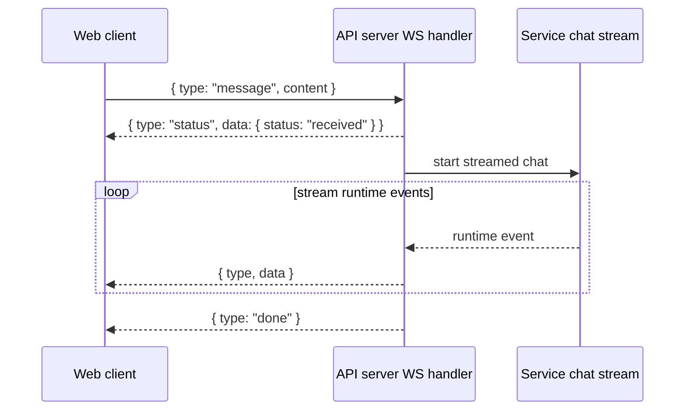

# API Contracts

> Deep reference (on-demand): use this document for API/transport/WebSocket tasks.
> For general architecture orientation, start with `docs/architecture/overview.md`.

This document defines stable contracts between frontend and backend services.

## Interactive API Documentation

The API server includes **Swagger UI** for interactive API testing and exploration:

- **Swagger UI**: http://localhost:3002/api-docs
- **OpenAPI JSON Spec**: http://localhost:3002/api-docs.json

Swagger UI provides:

- Complete API endpoint documentation with request/response schemas
- Interactive testing interface - try endpoints directly from the browser
- Request/response examples for all operations
- Schema exploration for data models

**Quick Test Workflow:**

1. Start the API server (see below)
2. Open http://localhost:3002/api-docs in your browser
3. Expand any endpoint to see details
4. Click "Try it out" to test with sample data
5. Execute requests and view real responses

## Base URL

- **Development**: `http://localhost:3002`
- **Production**: Same origin as web UI

## Common Response Patterns

### Success Response

```typescript
{
  // Response data varies by endpoint
}
```

### Error Response

```typescript
{
  error: string; // Error type/category
  message: string; // Human-readable error message
}
```

## Agents API

### List Agents

- **Endpoint**: `GET /api/agents`
- **Purpose**: Retrieve all agents in the team
- **Response**: `Agent[]`

### Get Agent

- **Endpoint**: `GET /api/agents/:agentId`
- **Purpose**: Get detailed information about a specific agent
- **Response**: `Agent`

## Team API

### Get Organization Graph

- **Endpoint**: `GET /api/team/graph`
- **Query**: `viewMode?: 'hierarchy' | 'features' | 'expertise' | 'matrix'`
- **Purpose**: Get team structure visualization data
- **Response**: `GraphData`

## Chat API

### Tool lifecycle stream events

Tool execution uses correlated, ordered events:

- `request` contains `toolCallId`, `toolName`, and input.
- `start` is optional transient progress.
- `result`, `error`, or `denied` contains the terminal output.

Request and terminal events are separate timeline entries and carry
independent timestamps. Clients must append them in stream order (using
`toolEventSeq` as the per-request tie-breaker) rather than merging them into a
single mutable component. Session replay emits the same request-then-terminal
shape from the split persistence records.

### Send Message

- **Endpoint**: `POST /api/chat/:agentId`
- **Purpose**: Send a message to an agent
- **Request Body**:

```typescript
{
  content: string;
  developerId: string;
}
```

- **Response**: `{ success: boolean }`

### WebSocket Chat

- **Endpoint**: `ws://localhost:3002/ws`
- **Purpose**: Real-time bidirectional chat communication
- **Client → Server message types**:
  - `message` — send a new chat message
  - `answer` — answer a pending server question (`questionId`, `value`)
  - `cancel` — abort the active turn
- **Server → Client envelope**:
  - `{ type, data }` for runtime events, plus terminal `done`
- **Common server event types**:
  - `status`, `token`, `tool`, `question`, `error`, `done`
- **Runtime detail**:
  - `data.kind` mirrors service runtime events (for example: `status`, `token`, `tool`, `question`, `handoff`, `log`, `code_edit_proposal`)
  - runtime events are correlated per request by `InteractionStream` using request-scoped queueing over a connection-scoped `EmitService` sink
  - command responses have status `ok`, `error`, or `cancelled`; handoff approval
    refusal/timeouts use `cancelled` and preserve their typed reason payload
  - `session_switched` may include the authoritative `agentId` and transition
    source; handoff events carry source/target identity and resolved model data



## Sessions API

### Transport Rule (HTTP vs WebSocket)

- **Rule**: If an operation invokes an LLM, use **WebSocket** so clients can observe runtime progress (`status`, `tool`, `token`, `question`, `done`, `error`).
- **Rule**: If an operation is short-lived and does **not** invoke an LLM, use **HTTP** for simplicity.
- **Implication for summarize flows**:
  - LLM-backed summarization should run over WebSocket.
  - HTTP summarize endpoints are acceptable only for non-LLM summarization paths.
  - When both exist during migration, WebSocket is the default for UI-triggered summarize actions.

### Export Note as Markdown

- **Endpoint**: `POST /api/sessions/:sessionId/notes/:noteId/export-markdown`
- **Purpose**: Export a note into a markdown file under `.ai-team/notes/` and relocate linked attachment files from ignored private storage into `.ai-team/notes/files/` so they can be committed.
- **Response**:

```typescript
{
  markdownPath: string;
  attachmentPath?: string;
}
```

### Crawl Website and Summarize into Note

- **Endpoint**: `POST /api/sessions/:sessionId/notes/:noteId/crawl-summarize`
- **Purpose**: Crawl a website (same-origin pages), summarize content with optional focus guidance, store crawl notes in note content, and update note compacted summary.
- **Transport guidance**: Because this path invokes an LLM, the preferred production path is WebSocket (streaming runtime/tool visibility). Keep HTTP for compatibility or non-LLM fallback only.
- **Request Body**:

```typescript
{
  websiteUrl: string;
  maxPages?: number; // default 5, max 20
  maxWords?: number; // summary limit hint
  focusInstruction?: string;
}
```

- **Response**: `Note`

### Get Latest Session

- **Endpoint**: `GET /api/sessions/:agentId/latest`
- **Purpose**: Get or create the most recent session for an agent
- **Response**: `ChatSession`

### List Sessions

- **Endpoint**: `GET /api/sessions`
- **Query**: `agentId: string, limit?: number`
- **Purpose**: Get recent sessions for an agent
- **Response**: `ChatSession[]`

### Get Session

- **Endpoint**: `GET /api/sessions/:sessionId`
- **Purpose**: Get session metadata
- **Response**: `ChatSession`

### Get Session Messages

- **Endpoint**: `GET /api/sessions/:sessionId/messages`
- **Purpose**: Get all messages in a session
- **Response**: `ChatMessage[]`

### Create Session

- **Endpoint**: `POST /api/sessions`
- **Purpose**: Create a new chat session
- **Request Body**:

```typescript
{
  agentId: string;
  developerId: string;
}
```

- **Response**: `ChatSession`

### Split Session

- **Endpoint**: `POST /api/sessions/:sessionId/split`
- **Purpose**: Split session history at a message index
- **Request Body**:

```typescript
{
  splitAtIndex: number;
  developerId: string;
}
```

- **Response**: `{ oldSession: ChatSession, newSession: ChatSession }`

### Summarize Messages

- **Endpoint**: `POST /api/sessions/:sessionId/summarize`
- **Purpose**: Create a brief/artifact from message range
- **Transport guidance**: If this route uses an LLM, it should be invoked through WebSocket so progress and tool events are visible to clients.
- **Request Body**:

```typescript
{
  fromIndex: number;
  toIndex: number;
  developerId: string;
}
```

- **Response**: `Artifact`

### Update Session

- **Endpoint**: `PATCH /api/sessions/:sessionId`
- **Purpose**: Update session metadata (e.g., artifacts in context)
- **Request Body**: `Partial<ChatSession>`
- **Response**: `ChatSession`

## Artifacts API

### List Artifacts

- **Endpoint**: `GET /api/artifacts`
- **Purpose**: Get all briefs and summaries
- **Response**: `Artifact[]`

### Get Artifact

- **Endpoint**: `GET /api/artifacts/:artifactId`
- **Purpose**: Get specific artifact content
- **Response**: `Artifact`

## Tasks API

### List Tasks

- **Endpoint**: `GET /api/tasks`
- **Purpose**: Get tasks with optional filtering
- **Query Parameters**:
  - `status?: TaskStatus | TaskStatus[]`
  - `priority?: TaskPriority | TaskPriority[]`
  - `assignedTo?: string`
  - `createdBy?: string`
  - `type?: TaskType | TaskType[]`
  - `tags?: string[]`
  - `parentTaskId?: string | "null"`
- **Response**: `Task[]`

### Get Task

- **Endpoint**: `GET /api/tasks/:taskId`
- **Purpose**: Get detailed task information
- **Response**: `Task`

### Get Task Hierarchy

- **Endpoint**: `GET /api/tasks/:taskId/hierarchy`
- **Purpose**: Get task with all subtasks recursively
- **Response**: `Task[]`

### Create Task

- **Endpoint**: `POST /api/tasks`
- **Purpose**: Create a new task
- **Request Body**:

```typescript
{
  type: TaskType;                // Required
  title: string;                 // Required
  description?: string;
  createdBy: string;             // Required
  createdByType: "human" | "agent";  // Required
  assignedTo?: string;
  priority: TaskPriority;
  requiresApproval: boolean;
  estimatedHours?: number;
  dueDate?: string;  // ISO date
  tags?: string[];
  workflowSteps?: Omit<WorkflowStep, "id" | "status" | "completedAt">[];
  metadata?: Record<string, any>;
}
```

- **Response**: `Task`

### Update Task

- **Endpoint**: `PATCH /api/tasks/:taskId`
- **Purpose**: Update task fields
- **Request Body**: `Partial<Task>`
- **Response**: `Task`

### Split Task

- **Endpoint**: `POST /api/tasks/:taskId/split`
- **Purpose**: Create subtasks for a parent task
- **Request Body**:

```typescript
{
  subtasks: Array<{
    type: TaskType;
    title: string;
    createdBy: string;
    createdByType: 'human' | 'agent';
    // ... other Task fields except id, parentTaskId, status, createdAt, updatedAt
  }>;
}
```

- **Response**: `Task[]` (created subtasks)

### Delegate Task

- **Endpoint**: `POST /api/tasks/:taskId/delegate`
- **Purpose**: Delegate task to another agent
- **Request Body**:

```typescript
{
  fromAgentId: string;   // Required
  toAgentId: string;     // Required
  reason?: string;
}
```

- **Response**: `Task`

### Log Time

- **Endpoint**: `POST /api/tasks/:taskId/time`
- **Purpose**: Log work time on a task
- **Request Body**:

```typescript
{
  agentId: string;           // Required
  durationMinutes: number;   // Required
  description?: string;
}
```

- **Response**: `Task`

### Get Dashboard Statistics

- **Endpoint**: `GET /api/tasks/dashboard`
- **Purpose**: Get aggregated task statistics
- **Response**: `TaskStatistics`

### List Templates

- **Endpoint**: `GET /api/tasks/templates`
- **Purpose**: Get available task templates
- **Response**: `TaskTemplate[]`

### Create from Template

- **Endpoint**: `POST /api/tasks/from-template`
- **Purpose**: Create task from a template with variable substitution
- **Request Body**:

```typescript
{
  templateId: string;                // Required
  variables: Record<string, string>; // Required
  overrides?: Partial<Task>;
}
```

- **Response**: `Task`

## Planning API

The planning endpoints expose the DB-backed planning pipeline (intake → plans → tasks → todos/delegations).

### Intake

- **List Intake**: `GET /api/planning/intake`
- **Upsert Intake Item**: `PUT /api/planning/intake/:intakeId`

### Plans

- **List Plans**: `GET /api/planning/plans`
- **Create Plan**: `POST /api/planning/plans`
- **Get Plan**: `GET /api/planning/plans/:planId`
- **Update Plan**: `PUT /api/planning/plans/:planId`
- **Get Plan Session Visibility**: `GET /api/planning/plans/:planId/sessions`

### Tasks

- **List Planning Tasks**: `GET /api/planning/tasks`
- **Create Planning Task**: `POST /api/planning/tasks`
- **Get Planning Task**: `GET /api/planning/tasks/:taskId`
- **Update Planning Task**: `PUT /api/planning/tasks/:taskId`

### Todos

- **List Task Todos**: `GET /api/planning/tasks/:taskId/todos`
- **Create Task Todo**: `POST /api/planning/tasks/:taskId/todos`
- **Update Task Todo**: `PUT /api/planning/todos/:todoId`

### Delegations

- **List Task Delegations**: `GET /api/planning/tasks/:taskId/delegations`
- **Create Task Delegation**: `POST /api/planning/tasks/:taskId/delegations`

### Planning Types

- **`PlanningIntakeItem`**: normalized intake source entry
- **`PlanningPlan`**: canonical plan record
- **`PlanningTask`**: session-owned executable task
- **`PlanningTodo`**: ordered checklist item under one planning task
- **`PlanningTaskDelegation`**: delegation history row for a planning task
- **`PlanningPlanSessionVisibility`**: derived session IDs from plan-linked tasks

## Health Check

### Server Health

- **Endpoint**: `GET /api/health`
- **Purpose**: Check if server is running
- **Response**:

```typescript
{
  status: 'ok';
  workspace: string;
}
```

## Data Types

### Agent

```typescript
{
  id: string;
  name: string;
  role: string;
  reportsTo?: string;
  features?: string[];
  specializations?: string[];
  status?: 'available' | 'busy' | 'in-meeting' | 'offline';
  markdown?: string;
  avatar?: AvatarConfig;
}
```

### ChatSession

```typescript
{
  id: string;              // session-2026-02-27-abc123
  agentId: string;
  developerId: string;     // clemens-meier
  startedAt: string;       // ISO timestamp
  lastActivityAt: string;  // ISO timestamp
  messageCount: number;
  artifacts: string[];     // Artifact IDs in context
  allowedFiles: string[];  // File paths agent can access
}
```

### ChatMessage

```typescript
{
  from: string;           // Agent or developer ID
  to?: string;            // Target agent (for handoffs)
  isHuman?: boolean;      // True if from developer
  content: string;
  timestamp: string;      // ISO timestamp
  archived?: boolean;
}
```

### Artifact

> Terminology note: **Artifact** is the runtime/API contract name for a user-facing **Document**.

```typescript
{
  id: string;                // brief-user-auth-design
  type: 'brief' | 'summary' | 'record' | 'document';
  title: string;
  content: string;           // Markdown content
  createdAt: string;         // ISO timestamp
  createdBy: string;         // Developer ID
  sourceSessionId: string;   // Session where created
  fromMessageIndex: number;  // Start of range
  toMessageIndex: number;    // End of range
  filepath: string;          // .ai-team/artifacts/briefs/*.md
  tags?: string[];
}
```

### Task

```typescript
{
  id: string;                      // FEAT-202602-A3D5
  type: "feature" | "bug" | "documentation";
  title: string;
  description?: string;
  createdBy: string;
  createdByType: "human" | "agent";
  assignedTo?: string;
  status: TaskStatus;              // See TaskStatus enum
  priority: "low" | "medium" | "high" | "urgent";
  requiresApproval: boolean;
  approved?: boolean;
  approvedBy?: string;
  approvedAt?: string;
  parentTaskId?: string;
  subtaskIds?: string[];
  executionMode?: "sequential" | "parallel";
  workflowSteps?: WorkflowStep[];
  estimatedHours?: number;
  actualHours?: number;
  timeLog?: TimeLogEntry[];
  dueDate?: string;
  startedAt?: string;
  completedAt?: string;
  cancelledAt?: string;
  tags?: string[];
  sessionId?: string;
  artifactIds?: string[];
  delegationHistory?: TaskDelegationRecord[];
  delegatedTo?: string;
  blockedReason?: string;
  blockedBy?: string[];
  metadata?: Record<string, any>;
  createdAt: string;
  updatedAt: string;
}
```

### TaskStatus Enum

- `not_started` - Created but not begun
- `in_progress` - Currently being worked on
- `blocked` - Waiting on dependencies
- `waiting_approval` - Pending human approval
- `completed` - Successfully finished
- `cancelled` - Abandoned
- `delegated` - Handed off to another agent

## Error Handling

All endpoints return appropriate HTTP status codes:

- **200 OK**: Successful GET/PATCH
- **201 Created**: Successful POST creating a resource
- **400 Bad Request**: Invalid request body or parameters
- **404 Not Found**: Resource not found
- **500 Internal Server Error**: Server-side error

Error responses include:

```typescript
{
  error: string; // Error category
  message: string; // Detailed error message
}
```

## Versioning and Compatibility

### Current Version

- API v1 (implicit, no version prefix in URLs)

### Compatibility Policy

- Breaking changes will require coordination between frontend and backend deployments
- Additive changes (new optional fields, new endpoints) are considered non-breaking
- Field deprecation will be communicated in advance

### Migration Strategy

When breaking changes are necessary:

1. Announce change to development team
2. Update backend with backward-compatible support
3. Update frontend to use new API
4. Remove old API support after transition period

### Type Safety

- TypeScript types should be kept in sync between packages
- `packages/core/src/types` - Source of truth
- `packages/web/src/types` - Browser-safe subset (no Node.js APIs)
- `packages/service` and `packages/api-server` import from core
