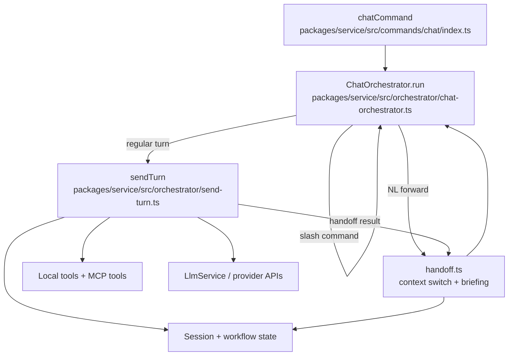
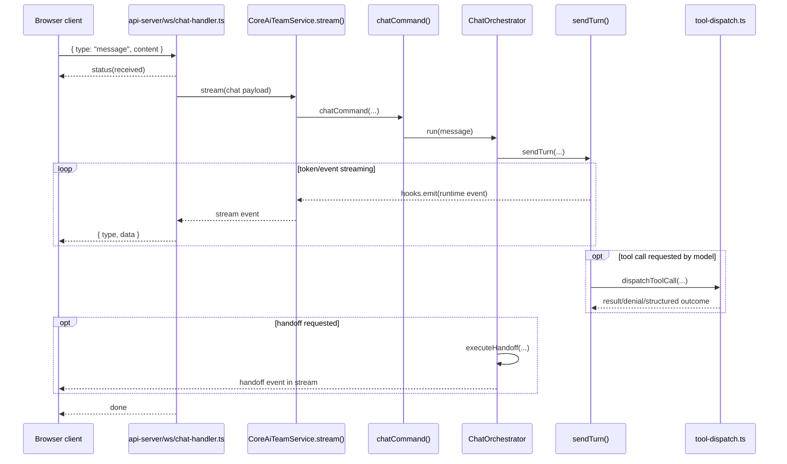
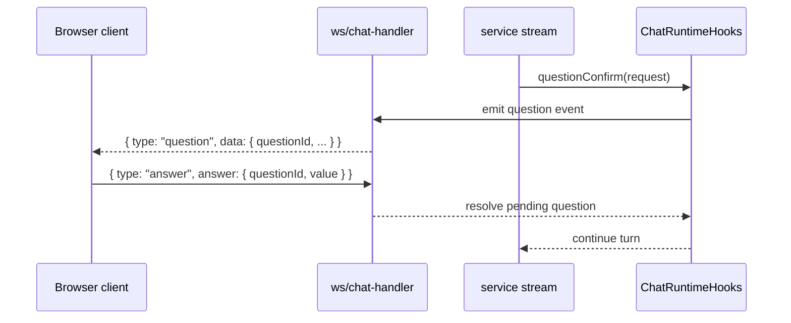
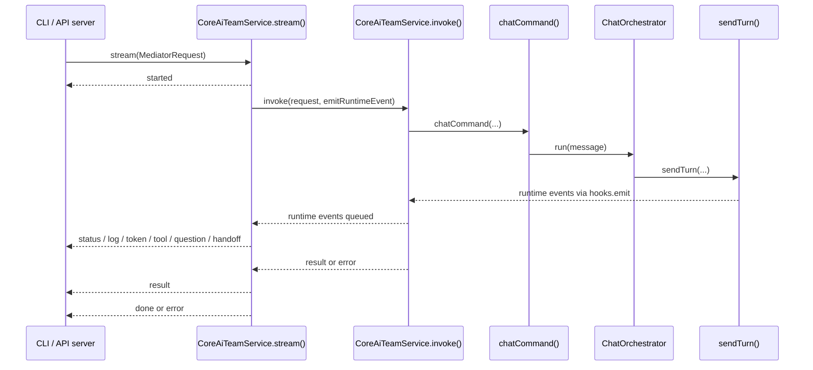

# Architecture Diagrams

These diagrams are the visual companion to [ARCHITECTURE.md](../../ARCHITECTURE.md). They focus on package responsibilities and runtime flows in the **current implementation**, while the active transition backlog lives in [`.ai-team/tasks/`](../../.ai-team/tasks/).

Use these diagrams together with the backlog to distinguish:

- what is true in the code today
- what is the intended target direction
- what is actively being migrated

## Package and transport map

This diagram shows what each package does and how the main runtime layers connect.

```mermaid
flowchart LR
  subgraph LocalAdapters[Local adapters]
    CLI[@ai-team/cli\nTerminal UX]
    VSC[@ai-team/vscode\nIDE-native review and open-file UX]
  end

  subgraph RemoteAdapters[Remote/browser adapters]
    WEB[@ai-team/web\nDashboard, portfolio, chat, sessions, tasks]
    HTTPCLIENT[@ai-team/api-client-http\nBrowser-safe REST + WebSocket client]
    APISERVER[@ai-team/api-server\nREST and WebSocket transport]
  end

  subgraph SharedRuntime[Shared runtime]
    LOCALCLIENT[@ai-team/api-client\nLocal typed client façade]
    IDE[@ai-team/ide-interface\nIDE bridge contracts]
    SERVICE[@ai-team/service\nOrchestration + transitional mediator boundary]
    CORE[@ai-team/core\nUI-free domain logic]
    FILECTX[file-context\nContextRuntime + parser + matcher]
  end

  STATE[.ai-team/*\nRuntime state]
  PROVIDERS[LLM / provider APIs]

  CLI --> LOCALCLIENT
  WEB --> HTTPCLIENT
  HTTPCLIENT -->|REST + WS| APISERVER
  APISERVER --> LOCALCLIENT
  LOCALCLIENT --> SERVICE
  SERVICE --> CORE
  CORE --> FILECTX
  CORE --> STATE
  SERVICE --> STATE
  SERVICE --> PROVIDERS

  CLI -. proposal/open-file bridge .-> IDE
  APISERVER -. proposal/open-file bridge .-> IDE
  IDE --> VSC
```

## Local, remote, and IDE execution paths

This diagram makes the three main runtime paths explicit.

```mermaid
flowchart TD
  START([User action]) --> CHOICE{Which surface?}

  CHOICE -->|CLI| CLI[@ai-team/cli]
  CHOICE -->|Browser| WEB[@ai-team/web]
  CHOICE -->|IDE review/open-file| IDEBRIDGE[@ai-team/ide-interface]

  CLI --> LOCALCLIENT[@ai-team/api-client]

  WEB --> HTTPCLIENT[@ai-team/api-client-http]
  HTTPCLIENT --> APISERVER[@ai-team/api-server]
  APISERVER --> LOCALCLIENT

  IDEBRIDGE --> VSC[@ai-team/vscode IDE-local server]

  LOCALCLIENT --> SERVICE[@ai-team/service]
  SERVICE --> CORE[@ai-team/core]
  CORE --> STATE[.ai-team/*]
  SERVICE --> PROVIDERS[LLM / provider APIs]
```

## Chat orchestration flow

This is the high-level control flow for the shared chat pipeline inside `@ai-team/service`.



## After a message reaches the server (WebSocket path)

This sequence focuses on what happens immediately after the browser sends a chat message.



## Question/answer round-trip during a turn

When a tool or workflow requires confirmation/input, the server pauses for a client answer.



## Mediator event bridge

This diagram shows how service runtime activity becomes adapter-facing stream events.



## Transition target (in progress)

This diagram shows the target direction that the backlog is steering toward. It is **not** a claim that the code is already fully there.

```mermaid
flowchart LR
  subgraph UISurfaces[UI surfaces]
    CLI[CLI]
    WEB[Web UI]
  end

  subgraph Boundary[Transport-independent boundary]
    SVC[Service interfaces]
    UIN[UI notifier]
    MAN[Manual execution service\nplanned]
  end

  subgraph ServiceLayer[Service layer]
    MED[Internal service-layer mediator]
    ORCH[Chat / tasks / orchestration]
  end

  subgraph LowerLayers[Boundary interfaces + implementations]
    CORE[@ai-team/core\nBoundary interfaces]
    INFRA[@ai-team/infrastructure\nImplementations]
  end

  CLI --> SVC
  WEB --> SVC
  SVC --> MED
  MED --> ORCH
  ORCH --> UIN
  UIN --> CLI
  UIN --> WEB
  MAN -. future explicit user path .-> ORCH
  ORCH --> CORE
  CORE --> INFRA
```

## VS Code proposal review loop

The VS Code extension is not a second service layer; it is the IDE-native review endpoint for proposal/open-file workflows.

```mermaid
flowchart LR
  SERVICE[@ai-team/service\ncode_edit_proposal event] --> STORE[ProposalStore]
  STORE --> CLI[@ai-team/cli]
  STORE --> APISERVER[@ai-team/api-server]

  CLI --> IDE[@ai-team/ide-interface]
  APISERVER --> IDE
  IDE --> VSC[@ai-team/vscode\nIDE-local server]
  VSC --> DIFF[Diff editor + CodeLens]
  VSC --> PENDING[Pending Changes view/panel]
  DIFF --> ACK[Ack Keep / Undo]
  PENDING --> ACK
  ACK --> IDE
```

## File-system access evaluation flow

This diagram shows how global file-tree defaults and per-agent `.perm` rules combine into effective rights.

```mermaid
flowchart TD
  REQUEST[Path + right request\nread/write/list] --> CM[packages/core/context/index.ts\nContextManager]

  GLOBAL[.ai-team/config.json\nfileTree.read/write paths] --> CM
  AGENTCFG[.ai-team/agents/*.agent.md
frontmatter: identity/tools/delegation metadata] --> CM
  AGENTACCESS[.ai-team/agents/<agent-id>.perm\nper-agent path policies] --> PARSE[loadAgentAccessPatterns + parseAccessFile]
  PARSE --> CM
  CM --> RUNTIME[file-context ContextRuntime]

  RUNTIME --> INHERIT[Rights inheritance\nwrite => read + list\nread => list]
  INHERIT --> PRECEDENCE[Explicit deny precedence]
  PRECEDENCE --> VERDICT[Allowed or denied verdict\nwith path-level rationale]

  VERDICT --> CLI[@ai-team/cli files/access views]
  VERDICT --> SERVICE[@ai-team/service commands]
  VERDICT --> API[@ai-team/api-server routes]
  VERDICT --> WEB[@ai-team/web file tree]
```

## Notes

- `@ai-team/api-client` and `@ai-team/api-client-http` are intentionally different client surfaces.
- `@ai-team/service` is the shared orchestration boundary in the current implementation.
- `@ai-team/vscode` is best understood as an IDE adapter reached through `@ai-team/ide-interface`, not as a peer orchestrator.
- The target direction is tracked in the local backlog under [`.ai-team/tasks/`](../../.ai-team/tasks/).
