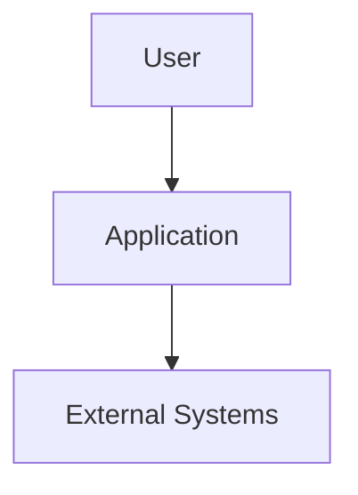
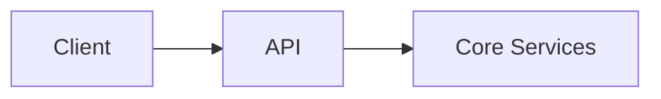

# Architecture Diagrams

Use Mermaid for high-level views.

## Context Diagram

```mermaid
flowchart TD
  User[User] --> App[Application]
  App --> Ext[External Systems]
```

## Container / Package Diagram

```mermaid
flowchart LR
  A[Client] --> B[API]
  B --> C[Core Services]
```
