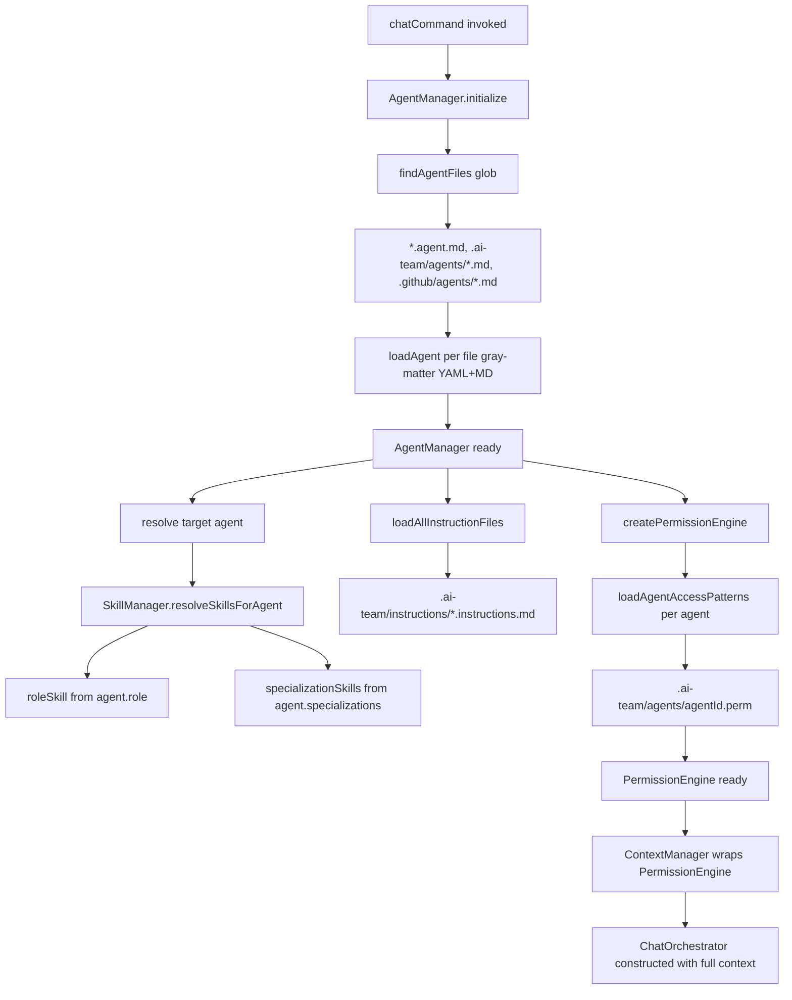
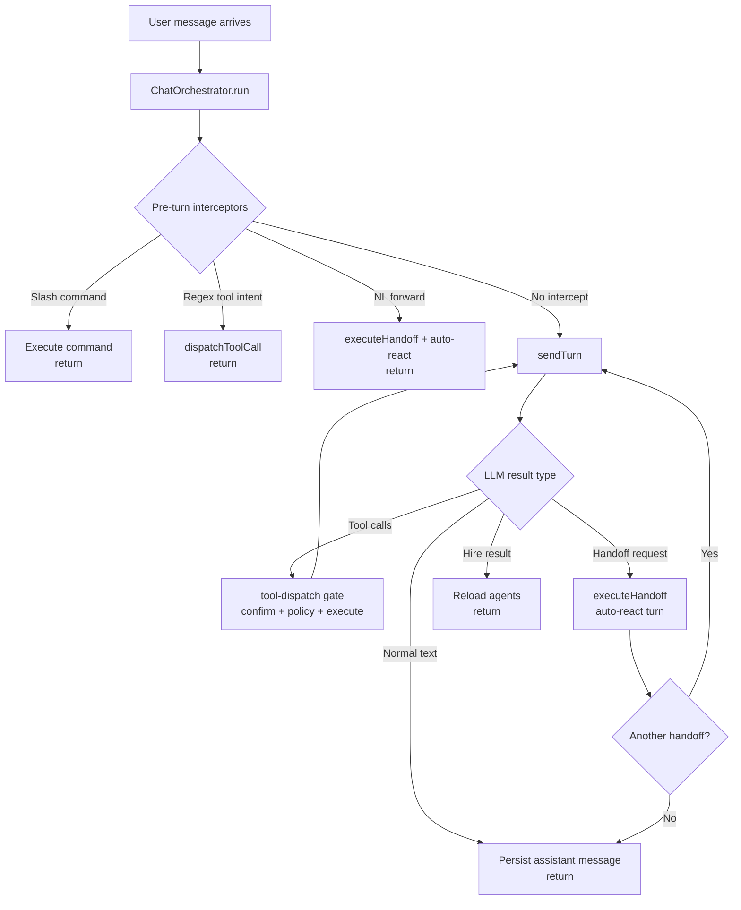
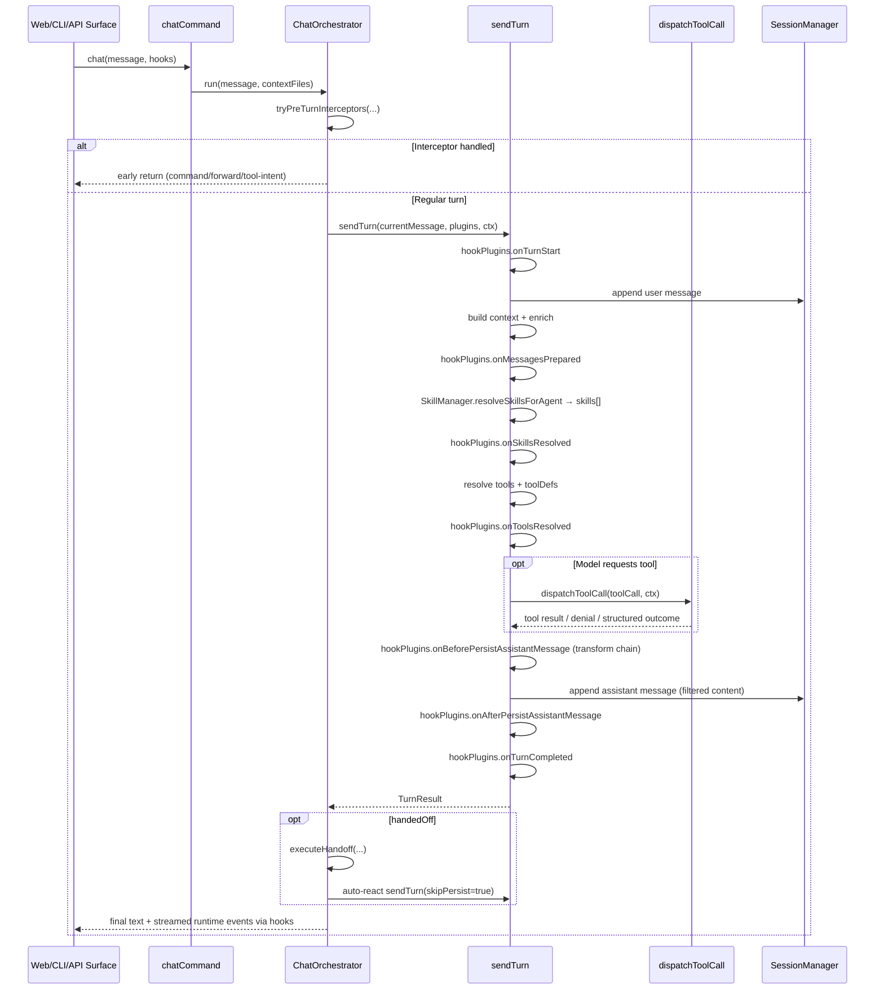
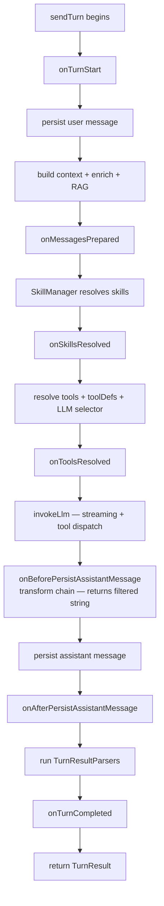
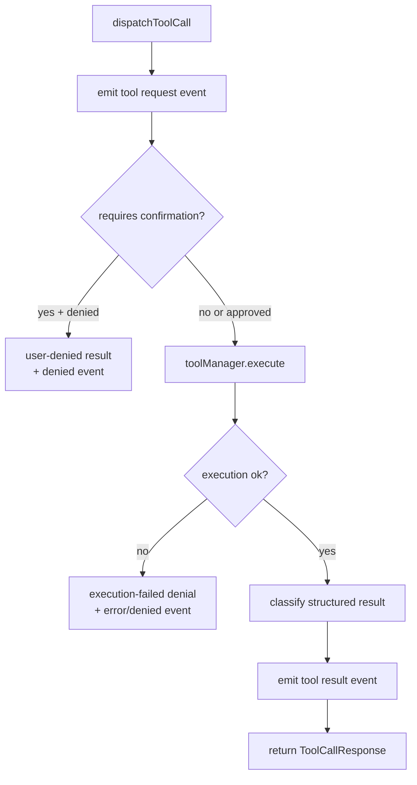

# Orchestrator runtime flow

Scope: technical flow inside `@ai-team/service` after a message is submitted.

## Components and responsibilities

- `chat-orchestrator.ts`: entry loop, pre-turn interceptors, hop control, handoff/hire handling
- `send-turn.ts`: one LLM turn (persist, build context, resolve skills, call model, run hook plugins, parse outcomes)
- `tool-dispatch.ts`: single tool gate (confirm, policy, execute, emit tool events)
- `handoff.ts`: session resolution + briefing + context switch
- `stream-events.ts`: runtime event wrappers over `hooks.emit`
- `pipeline.ts`: all extension-surface interfaces (open/closed principle)
- `defaults/hook-plugins.ts`: default `IOrchestratorHookPlugin` implementations including `StripInternalHandoffDirectivePlugin`

## Startup phase (before first message)

Before any message reaches the orchestrator, `chatCommand()` runs a wired startup sequence.



### What each piece provides

| Component | File pattern | Provides |
|---|---|---|
| Agent portfolio | `**/*.agent.md`, `.ai-team/agents/*.md`, `.github/agents/*.md` | Identity, role, reporting line, `specializations` |
| Role skill instructions | `.ai-team/roles/<role>.md` | System prompt body for the agent's role (resolved by `SkillManager` via `agent.role`) |
| Specialization skill instructions | `.ai-team/roles/<specialization>.md` | Additional system prompt sections for each value in `agent.specializations[]` |
| Workspace instructions | `.ai-team/instructions/*.instructions.md` | Appended instructions filtered by `applyTo` glob |
| Per-agent access rules | `.ai-team/agents/<agentId>.perm` | File-level read/write/create/delete permission patterns |
| Global fileTree config | `config.json → fileTree` | Workspace-wide path overrides merged with agent rules |

### Access enforcement

`ContextManager.canRead/canWrite/canCreate/canDelete` delegates to `PermissionEngine`. Every file tool call goes through `ContextManager` before execution. The engine evaluates the requesting agent against the pattern set from its `.perm` file.

```ts
// packages/core/src/context/index.ts
canRead(agent: Agent, filePath: string): AccessVerdict {
  return this.engine
    ? this.engine.evaluate(agent.id, 'read', filePath)
    : this.globCheck(agent, filePath);
}
```

```ts
// packages/core/src/storage/index.ts — loading access patterns at startup
export async function loadAgentAccessPatterns(workspaceRoot: string, agentId: string): Promise<AccessPatternSet> {
  const filePath = getAgentAccessFilePath(workspaceRoot, agentId); // .ai-team/agents/<id>.perm
  const content = await fs.readFile(filePath, 'utf-8');
  const rules = parseAccessFile(content);
  return accessRulesToPatternSet(rules);
}
```

## Control flow (single message)



## Information flow (sequence)



## Hook plugin lifecycle

The orchestrator exposes a multi-hook plugin extension point via `IOrchestratorHookPlugin` (defined in `pipeline.ts`). Each plugin implements any subset of the 7 lifecycle hooks; all hooks are optional.

Hook plugins are registered in the DI container under `TOKENS.HookPlugins` and resolved into `ResolvedPlugins.hookPlugins`. The built-in set is created by `buildDefaultHookPlugins()` in `defaults/hook-plugins.ts`.



### Hook contracts

| Hook | Type | Payload | Return |
|---|---|---|---|
| `onTurnStart` | void | `{ userMessage, options?, ctx }` | — |
| `onMessagesPrepared` | void | `{ messages, ctx }` | — |
| `onSkillsResolved` | void | `{ skills[], missingSkillNames[], ctx }` | — |
| `onToolsResolved` | void | `{ tools[], toolDefs[], ctx }` | — |
| `onBeforePersistAssistantMessage` | **transform** | `{ fullResponse, persistedContent, ctx }` | `string \| void` — returned string replaces `persistedContent` for persistence |
| `onAfterPersistAssistantMessage` | void | `{ fullResponse, persistedContent, persistedMessage, ctx }` | — |
| `onTurnCompleted` | void | `{ fullResponse, persistedContent, structuredResults, turnResult, ctx }` | — |

`onBeforePersistAssistantMessage` is a **transform chain**: each plugin in sequence receives the `persistedContent` from the previous plugin and returns an updated string (or `void`/`undefined` to pass through unchanged). The final value is what gets written to the database — the developer never sees the raw `fullResponse` bearing internal directives.

### Default hook plugins

| Plugin class | Hook | Purpose |
|---|---|---|
| `StripInternalHandoffDirectivePlugin` | `onBeforePersistAssistantMessage` | Strips `HANDOFF:` / `FORWARD_TO:` directives from the persisted content. Emits an `info` log event when stripping occurs. |

### Registering a custom plugin

Implement `IOrchestratorHookPlugin` and pass it in `OrchestratorPlugins.hookPlugins[]`. Custom plugins are merged with the default set; they do not replace it.

```ts
class MyAuditPlugin implements IOrchestratorHookPlugin {
  readonly name = 'my-audit';

  onTurnCompleted({ turnResult, ctx }: TurnCompletedHookPayload): void {
    // log to external audit sink
  }
}

chatCommand({ hookPlugins: [new MyAuditPlugin()] });
```

## Tool gate details



## Simplified implementation snippets (close to real code)

### 1) Interceptor short-circuit

```ts
const preTurnResult = await this.tryPreTurnInterceptors(message, options.contextFiles);
if (preTurnResult !== undefined) return preTurnResult;
```

### 2) Pre-turn interceptor structure (simplified, close to real)

```ts
private async tryPreTurnInterceptors(message: string, contextFiles?: string[]) {
  const slashResult = await this.trySlashCommand(message);
  if (slashResult !== null) return slashResult;

  const regexIntentResult = await this.tryRegexToolIntent(message, contextFiles);
  if (regexIntentResult !== null) return regexIntentResult;

  const nlResult = await tryNlForward(message, this.ctx);
  if (nlResult === null) return undefined;

  if (nlResult === 'forwarded') {
    await sendTurn(HANDOFF_AUTO_MSG, this.plugins, this.ctx, { skipPersist: true });
    return '';
  }

  return nlResult;
}
```

### 3) Main turn loop and outcome handling

```ts
for (let hops = 0; hops < maxHops; hops++) {
  const result = await sendTurn(currentMessage, this.plugins, this.ctx);
  lastText = result.text;

  if (result.hired) {
    await this.ctx.agentManager.loadAllAgents();
    break;
  }

  if (result.handedOff && result.handoffTargetId) {
    const switched = await executeHandoff(
      this.ctx,
      result.handoffTargetId,
      result.handoffTargetSessionId,
      result.handoffNote,
    );
    if (!switched) break;

    const autoResult = await sendTurn(autoMsg, this.plugins, this.ctx, { skipPersist: true });
    lastText = autoResult.text;
    if (!autoResult.handedOff) break;
    continue;
  }

  break;
}
```

### 4) sendTurn skill resolution (via SkillManager)

```ts
const resolvedSkills = ctx.skillManager.resolveSkillsForAgent(ctx.agent);
if (resolvedSkills.roleSkill) {
  emitLog(hooks, 'info', `[skills] Loaded role skill: ${resolvedSkills.roleSkill.name}`);
}
for (const skill of resolvedSkills.specializationSkills) {
  emitLog(hooks, 'info', `[skills] Loaded specialization skill: ${skill.name}`);
}
for (const missing of resolvedSkills.missingSkillNames) {
  emitLog(hooks, 'warn', `[skills] Skill not found: ${missing}`);
}
// resolvedSkills.skills is the merged Skill[] passed to llmService.chatWithTools(...)
```

`resolveSkillsForAgent` returns `ResolvedAgentSkills` (exported from `@ai-team/core/skill`):

```ts
interface ResolvedAgentSkills {
  roleSkill?: Skill;               // matched by agent.role
  specializationSkills: Skill[];   // matched by agent.specializations[]
  skills: Skill[];                 // merged: [roleSkill?, ...specializationSkills]
  missingSkillNames: string[];     // skill names that were not found in the skill library
}
```

### 5) sendTurn tool-calling callback into secure dispatch

```ts
llmService.chatWithTools(..., async (toolCall) => {
  const response = await dispatchToolCall(
    { toolCallId: toolCall.toolCallId, toolName: toolCall.toolName, args: toolCall.args },
    ctx,
  );
  return {
    toolCallId: response.toolCallId,
    toolName: response.toolName,
    result: response.result,
    isError: response.isError,
  };
});
```

### 6) sendTurn hook plugin transform chain (before persistence)

```ts
const persistedContent = await runBeforePersistMessageHooks(
  hookPlugins,
  { fullResponse, persistedContent: fullResponse, ctx },
  hooks,
);
// Each plugin in hookPlugins that implements onBeforePersistAssistantMessage
// receives the current persistedContent and may return a modified string.
// The final value is written to the session store.
```

### 7) tool-dispatch execution and eventing (simplified)

```ts
emitEvent(ctx.hooks, { kind: 'tool', toolName, toolPhase: 'request', message: label });

const deniedByUser = await requestExecutionApproval(toolName, label, ctx);
if (deniedByUser) {
  return { toolCallId, toolName, result: deniedByUser.message, isError: false, denial: deniedByUser };
}

const execResult = await ctx.toolManager.execute(
  ctx.agent,
  toolName,
  args,
  { workspaceRoot: ctx.workspaceRoot, currentFiles: contextFiles },
);

emitToolEvent(ctx.hooks, toolName, execResult.ok ? 'result' : 'error', ...);
```

### 8) Runtime event helper usage

```ts
emitStatus(hooks, 'thinking');
emitStatus(hooks, 'handoff', `${this.ctx.agent.name} taking over.`);
emitLog(hooks, 'warn', 'Handoff requested to unknown agent');
```

## Runtime events emitted

The orchestrator path emits structured runtime events through `hooks.emit`:

- `status`: phase changes (`thinking`, `handoff`, `error`)
- `token`: streamed text deltas
- `tool`: request/start/result/error/denied
- `question`: confirmation/input/checklist/select prompts
- `handoff`: from/to agent + session metadata
- `log`: runtime diagnostics (including `[skills]` events for loaded/missing skills and `[filter]` events from hook plugins)

## Pipeline extension interfaces

All extension seams are defined in `pipeline.ts` (open/closed principle). The interfaces available as of this writing:

| # | Interface | Role in the pipeline |
|---|---|---|
| 1 | `IContextCompressor` | Prune/summarize message history before context assembly |
| 2 | `IContextBuilder` | Assemble `ChatCompletionMessageParam[]` including system prompt |
| 3 | `IContextEnricher` | Role-aware system message injections (workspace overview, team roster, etc.) |
| 4 | `IRagProvider` | Retrieval-augmented generation — inject relevant file content |
| 5 | `IToolResolver` | Determine which tools are available to the agent for this turn |
| 6 | `IMcpGateway` | Discover tools from external Model Context Protocol servers |
| 7 | `ILlmSelector` | Select and initialize the LLM model/provider for the turn |
| 8 | `IOutputHandler` | Persist result and emit surface events |
| 9 | `ITurnResultParser` | Interpret raw turn outputs (handoff, hire, normal) — first match wins |
| 10 | `ISlashCommand` | A single `/key` command executed by the pre-turn interceptor |
| 11 | `IOrchestratorHookPlugin` | Multi-hook plugin: one plugin registers any subset of the 7 lifecycle hooks |

Default implementations live under `orchestrator/defaults/`. Stub no-op implementations satisfy every interface so the pipeline is always fully wired.

## Source files

- [`packages/service/src/orchestrator/chat-orchestrator.ts`](../../packages/service/src/orchestrator/chat-orchestrator.ts)
- [`packages/service/src/orchestrator/send-turn.ts`](../../packages/service/src/orchestrator/send-turn.ts)
- [`packages/service/src/orchestrator/tool-dispatch.ts`](../../packages/service/src/orchestrator/tool-dispatch.ts)
- [`packages/service/src/orchestrator/handoff.ts`](../../packages/service/src/orchestrator/handoff.ts)
- [`packages/service/src/orchestrator/pipeline.ts`](../../packages/service/src/orchestrator/pipeline.ts) — all extension interfaces and payload types
- [`packages/service/src/orchestrator/defaults/hook-plugins.ts`](../../packages/service/src/orchestrator/defaults/hook-plugins.ts) — default hook plugin implementations
- [`packages/service/src/contracts.ts`](../../packages/service/src/contracts.ts)
- [`packages/core/src/skill/index.ts`](../../packages/core/src/skill/index.ts) — `SkillManager` + `resolveSkillsForAgent()` + `ResolvedAgentSkills`
