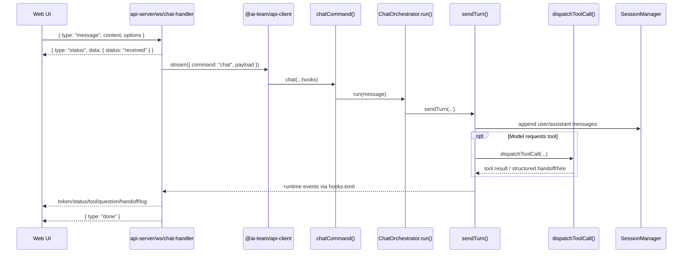

# Architecture Overview

This document is the short, human-readable summary of the current AI Team architecture. For the canonical detail, see [ARCHITECTURE.md](../../ARCHITECTURE.md). For visual references, see [diagrams.md](./diagrams.md).

The long-running local backlog for this transition lives in [`.ai-team/tasks/`](../../.ai-team/tasks/). Use that backlog together with this document to distinguish the **current implementation**, the **target direction**, and the **active work in progress**.

## What AI Team is

AI Team is a TypeScript monorepo for running a file-backed virtual software organization across CLI, web, API, and VS Code surfaces.

The core design idea is simple:

- keep **domain logic** reusable and UI-free
- keep **application orchestration** in one shared service layer
- keep **transport and UX concerns** at the edges
- keep **runtime state** rooted under `.ai-team/`

## Current state vs target direction

- **Current state**
  - `@ai-team/service` still presents a mediator-oriented contract for both business calls and UI-facing streaming in several paths.
  - The web chat path is functional but part of the active cleanup work.
- **Target direction**
  - UI surfaces call transport-independent service interfaces.
  - An internal service-layer mediator stays inside the service layer.
  - UI-facing streaming is delivered through a `UI notifier` concept.
  - Strict dependency injection is enforced at the logic ↔ infrastructure boundary.
  - `@ai-team/service` depends on interfaces from `@ai-team/core`; concrete implementations are selected by container bootstrap.
  - `@ai-team/service` must not import `@ai-team/infrastructure` directly.
  - The same UI should be able to swap client implementations at startup.
- **Active roadmap**
  - docs/backlog alignment
  - messenger / mediator clarification
  - UI chat stabilization
  - strict DI rollout
  - service / infrastructure decoupling

## The current runtime at a glance

AI Team has three important runtime paths.

### Local command path

The CLI uses a local in-process client and service path:

`@ai-team/cli -> @ai-team/api-client -> @ai-team/service -> @ai-team/core -> .ai-team/*`

### Remote browser path

The web UI uses a remote transport path:

`@ai-team/web -> @ai-team/api-client-http -> @ai-team/api-server -> @ai-team/api-client -> @ai-team/service -> @ai-team/core -> .ai-team/*`

### IDE integration path

Editor-local workflows use a dedicated IDE bridge:

`CLI or api-server -> @ai-team/ide-interface -> @ai-team/vscode IDE-local server -> VS Code-native review/open-file UX`

## Main package responsibilities

### `file-context`

- shared file-context library at repository root
- provides `.perm` parsing, glob matching, overlap analysis, and `ContextRuntime`
- powers per-agent `.ai-team/agents/<agent-id>.perm` path policies
- used by `@ai-team/core` context management as the underlying rights runtime

### `@ai-team/core`

- UI-free domain logic and shared types
- workspace-backed file/domain operations
- agent, team, skill, context, and tool primitives
- `ContextManager` compatibility API backed by `file-context` `ContextRuntime`

### `@ai-team/service`

- current state: mediator contracts, command dispatch, runtime event streaming, chat orchestration, and session/task/workflow/proposal state
- target direction: transport-independent service interfaces for callers, internal service-layer mediation kept private, and explicit UI notifier delivery for outward streaming
- boundary rule: depend only on `@ai-team/core` interfaces and container tokens; implementation packages are composed at startup and must not be imported directly from service code or service tests

### `@ai-team/api-client`

- local typed client façade used by local adapters and the API server

### `@ai-team/api-client-http`

- browser-safe remote client using REST and WebSocket transport
- target direction: one possible implementation of the same service interfaces consumed by UI callers

### `@ai-team/api-server`

- HTTP and WebSocket transport layer for browser/remote clients
- target direction: bridge service interfaces and UI notifier delivery without becoming a second service layer

### `@ai-team/ide-interface`

- shared IDE bridge contracts and discovery/wire protocol

### Adapter packages

- `@ai-team/cli` - terminal UX and prompts
- `@ai-team/vscode` - VS Code-native review/open-file integration
- `@ai-team/web` - browser UI for dashboard, graph, portfolio, chat, sessions, and context/task surfaces

The long-term goal for `@ai-team/web` is to receive its client implementations through startup composition so the same UI can run in different hosts.

## Mermaid package view

```mermaid
flowchart LR
  subgraph Adapters[Adapters and transports]
    CLI[@ai-team/cli]
    WEB[@ai-team/web]
    VSC[@ai-team/vscode]
    APISERVER[@ai-team/api-server]
    HTTPCLIENT[@ai-team/api-client-http]
  end

  subgraph Shared[Shared contracts and runtime]
    LOCALCLIENT[@ai-team/api-client]
    IDE[@ai-team/ide-interface]
    SERVICE[@ai-team/service]
    CORE[@ai-team/core]
    FILECTX[file-context]
  end

  STATE[.ai-team/* runtime state]
  PROVIDERS[LLM / provider APIs]

  CLI --> LOCALCLIENT
  WEB --> HTTPCLIENT
  HTTPCLIENT --> APISERVER
  APISERVER --> LOCALCLIENT
  LOCALCLIENT --> SERVICE
  SERVICE --> CORE
  CORE --> FILECTX
  CORE --> STATE
  SERVICE --> STATE
  SERVICE --> PROVIDERS

  CLI -. IDE bridge .-> IDE
  APISERVER -. IDE bridge .-> IDE
  IDE --> VSC
```

## Chat runtime summary

The shared chat behavior lives in `@ai-team/service`, not in the adapters.

`chatCommand()` in `packages/service/src/commands/chat/index.ts` is the thin bootstrap. `ChatOrchestrator` and `sendTurn()` own the real orchestration behavior:

- slash command routing
- natural-language forwarding
- handoff flow
- turn loop and hop limits
- context build and enrichment
- tool resolution and tool dispatch
- model selection and LLM invocation
- workflow questions and runtime events

That shared service-level orchestration keeps CLI and remote chat behavior aligned.

`com_ask` is now a first-class orchestration tool in this shared runtime path. Question bridges (input/confirm/select/password/checklist) are injected at dispatch time so web and CLI surfaces can render native prompts while the orchestrator remains transport-agnostic.

The active architecture transition is about separating:

- business-facing **service interfaces**
- internal **service-layer mediator** behavior
- outward **UI notifier** delivery
- UI-specific **surface handlers/controllers**

## What happens after you send a message to the server

This is the practical end-to-end flow for the **remote browser path** (`web -> api-server -> service`).

1. The web client sends a WebSocket message (`type: "message"`) to `/ws/chat/:agentId`.
2. The API server acknowledges receipt with a quick status event (`status: received`).
3. The WebSocket handler starts a streaming `chat` command via `client.stream(...)`.
4. `chatCommand()` builds an `OrchestratorContext` and calls `ChatOrchestrator.run(...)`.
5. `ChatOrchestrator` checks pre-turn interceptors (slash commands, regex intents, NL forward).
6. For a normal turn, `sendTurn(...)` builds context, resolves tools, and invokes the model.
7. Tool calls are executed through `dispatchToolCall(...)` (confirmation, policy, execution, structured outcomes).
8. Runtime events (`status`, `token`, `tool`, `question`, `handoff`, `log`) are emitted and streamed back over WebSocket.
9. Session/history persistence happens in the service layer (`SessionManager`) during turn execution.
10. The server emits `done` when the turn stream completes.

### Remote server message lifecycle (WebSocket)



### Runtime event mapping at the server boundary

- Internal mediator event kinds from service: `status`, `progress`, `log`, `token`, `tool`, `question`, `code_edit_proposal`, `handoff`
- WebSocket event envelope from API server: `type` + `data`
  - common `type` values sent to browser: `status`, `token`, `tool`, `question`, `error`, `done`
  - for rich runtime events, `data.kind` preserves the original service event kind

## Current frontend state reality

`packages/web` is currently a **hybrid** architecture rather than the fully migrated target state.

- Some persisted API-backed data already uses TanStack Query hooks.
- Chat runtime behavior is still concentrated in feature components like `ChatPanel.tsx`.
- Zustand is still a target direction for shared live runtime state, not the dominant current pattern.

In short: the architecture direction is clear, but the frontend is still mid-migration rather than “finished.”

## Key invariants

- `@ai-team/core` must stay UI-free.
- `@ai-team/service` owns orchestration.
- Remote and local clients are different on purpose.
- IDE integration stays behind `@ai-team/ide-interface` and the VS Code adapter.
- Runtime state conventions stay under `.ai-team/`.

## Access and file-system model (current)

- File-path rights are evaluated through `ContextManager` (`packages/core/src/context/index.ts`) backed by `file-context` `ContextRuntime`.
- Agent-specific path rules live in `.ai-team/agents/<agent-id>.perm`.
- Agent frontmatter should not carry file-path access globs.
- Rights inheritance:
  - `write => read + list`
  - `read => list`
- Explicit deny patterns still override inherited allows.

## Where to go next

- Canonical architecture and boundaries: [ARCHITECTURE.md](../../ARCHITECTURE.md)
- Active local backlog: [`.ai-team/tasks/`](../../.ai-team/tasks/)
- Mermaid diagrams: [docs/architecture/diagrams.md](./diagrams.md)
- Orchestrator one-page brief: [docs/architecture/orchestrator-overview.md](./orchestrator-overview.md)
- Web state guidance: [docs/implementation/web-state-architecture.md](../implementation/web-state-architecture.md)
- Tactical implementation hotspots: [COPILOT-CONTEXT.md](../../COPILOT-CONTEXT.md)
