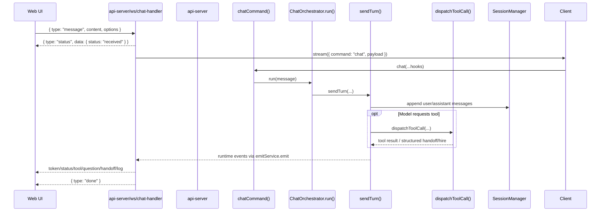

# Architecture Overview

This document is the short, human-readable summary of the current AI Team architecture. For the canonical detail, see [ARCHITECTURE.md](../../ARCHITECTURE.md). For visual references, see [diagrams.md](./diagrams.md).

## Progressive disclosure map (read order)

Use this order to avoid loading excessive context:

1. **This file (`overview.md`)** — fast orientation (start here)
2. **`docs/architecture/diagrams.md`** — visual runtime/package map
3. **`ARCHITECTURE.md`** — deep architecture narrative (only when needed)
4. **`docs/architecture/implementation-entry-points.md`** — deep code-navigation index (only when needed)
5. **`docs/api/contracts.md`** — API/WebSocket contracts (only for API/transport tasks)

If your task is small or local, do not preload steps 3–5.

The long-running local backlog for this transition lives in [`.ai-team/tasks/`](../../.ai-team/tasks/). Use that backlog together with this document to distinguish the **current implementation**, the **target direction**, and the **active work in progress**.

## Token/cost budget guidance

- Keep default task context lean: load the smallest doc surface that can answer the current question.
- Escalate to deeper docs only after identifying a concrete gap.
- Prefer links over duplicating deep content across entry docs.

## Service-layer DI invariant (must follow)

- Emitter usage must be DI-driven (`IEmitService`), not context/hook lookups.
- Avoid patterns like `hooks.emitService` / `ctx.emitService` / reading emit from `ExecutionContext` inside service/orchestrator helpers.
- Keep `ExecutionContext` focused on conversation/runtime state.
- Identity fallbacks from execution context (for example `ctx.agent?.id ?? ctx.agentId`) are acceptable where runtime identity can legitimately be absent.

## What AI Team is

AI Team is a TypeScript monorepo for running a file-backed virtual software organization across CLI, web, API, and VS Code surfaces.

The core design idea is simple:

- keep **domain logic** reusable and UI-free
- keep **application orchestration** in one shared service layer
- keep **transport and UX concerns** at the edges
- keep **runtime state** rooted under `.ai-team/`

## Current state vs target direction

- **Current state**
  - `@ai-team/service` still presents a mediator-oriented contract for both business calls and UI-facing streaming in several paths.
  - The web chat path is functional but part of the active cleanup work.
- **Target direction**
  - UI surfaces call transport-independent service interfaces.
  - An internal service-layer mediator stays inside the service layer.
  - UI-facing streaming is delivered through a `UI notifier` concept.
  - Strict dependency injection is enforced at the logic ↔ infrastructure boundary.
  - `@ai-team/service` depends on interfaces from `@ai-team/core`; concrete implementations are selected by container bootstrap.
  - `@ai-team/service` must not import `@ai-team/infrastructure` directly.
  - The same UI should be able to swap client implementations at startup.
- **Active roadmap**
  - docs/backlog alignment
  - messenger / mediator clarification
  - UI chat stabilization
  - strict DI rollout
  - service / infrastructure decoupling

## The current runtime at a glance

AI Team has three important runtime paths.

### Local command path

The CLI uses a local in-process client and service path:

`@ai-team/cli -> @ai-team/service -> @ai-team/core -> .ai-team/*`

### Remote browser path

The web UI uses a remote transport path:

`@ai-team/web -> @ts-http -> @ai-team/api-server -> @ai-team/api-contracts -> @ai-team/service -> @ai-team/core -> .ai-team/*`

### IDE integration path

Editor-local workflows use a dedicated IDE bridge:

`CLI or api-server -> @ai-team/ide-interface -> @ai-team/vscode IDE-local server -> VS Code-native review/open-file UX`

## Main package responsibilities

### `fs-context`

- shared fs-context library at repository root
- provides `.perm` parsing, glob matching, overlap analysis, and `ContextRuntime`
- powers per-agent `.ai-team/agents/<agent-id>.perm` path policies
- used by `@ai-team/core` context management as the underlying rights runtime

### `@ai-team/core`

- UI-free domain logic and shared types
- workspace-backed file/domain operations
- agent, team, skill, context, and tool primitives
- `ContextManager` compatibility API backed by `fs-context` `ContextRuntime`

### `@ai-team/service`

- current state: mediator contracts, command dispatch, runtime event streaming, chat orchestration, and session/task/workflow/proposal state
- target direction: transport-independent service interfaces for callers, internal service-layer mediation kept private, and explicit UI notifier delivery for outward streaming
- boundary rule: depend only on `@ai-team/core` interfaces and container tokens; implementation packages are composed at startup and must not be imported directly from service code or service tests

### `@ai-team/api-contracts`

- service interface contracts and wire protocol types
- used by both local and remote clients

### `@ts-http`

- browser-safe remote client using REST and WebSocket transport
- used by `@ai-team/web` to call the API server

### `@ai-team/api-server`

- HTTP and WebSocket transport layer for browser/remote clients
- target direction: bridge service interfaces and UI notifier delivery without becoming a second service layer

### `@ai-team/ide-interface`

- shared IDE bridge contracts and discovery/wire protocol

### Adapter packages

- `@ai-team/cli` - terminal UX and prompts
- `@ai-team/vscode` - VS Code-native review/open-file integration
- `@ai-team/web` - browser UI for dashboard, graph, portfolio, chat, sessions, and context/task surfaces

The long-term goal for `@ai-team/web` is to receive its client implementations through startup composition so the same UI can run in different hosts.

## Mermaid package view

```mermaid
flowchart LR
  subgraph Adapters[Adapters and transports]
    CLI[@ai-team/cli]
    WEB[@ai-team/web]
    VSC[@ai-team/vscode]
    APISERVER[@ai-team/api-server]
    TSCHTTP[@ts-http]
  end

  subgraph Shared[Shared contracts and runtime]
    CONTRACTS[@ai-team/api-contracts]
    IDE[@ai-team/ide-interface]
    SERVICE[@ai-team/service]
    CORE[@ai-team/core]
    FILECTX[fs-context]
  end

  STATE[.ai-team/* runtime state]
  PROVIDERS[LLM / provider APIs]

  CLI --> LOCALCLIENT
  WEB --> HTTPCLIENT
  HTTPCLIENT --> APISERVER
  APISERVER --> LOCALCLIENT
  LOCALCLIENT --> SERVICE
  SERVICE --> CORE
  CORE --> FILECTX
  CORE --> STATE
  SERVICE --> STATE
  SERVICE --> PROVIDERS

  CLI -. IDE bridge .-> IDE
  APISERVER -. IDE bridge .-> IDE
  IDE --> VSC
```

## Chat runtime summary

The shared chat behavior lives in `@ai-team/service`, not in the adapters.

`chatCommand()` in `packages/service/src/commands/chat/chat.command.ts` is the thin bootstrap. `ChatOrchestrator` and `sendTurn()` own the real orchestration behavior:

- slash command routing
- natural-language forwarding
- handoff flow
- turn loop and hop limits
- context build and enrichment
- tool resolution and tool dispatch
- model selection and LLM invocation
- workflow questions and runtime events

That shared service-level orchestration keeps CLI and remote chat behavior aligned.

`com_ask` is now a first-class orchestration tool in this shared runtime path. Question bridges (input/confirm/select/password/checklist) are injected at dispatch time so web and CLI surfaces can render native prompts while the orchestrator remains transport-agnostic.

The active architecture transition is about separating:

- business-facing **service interfaces**
- internal **service-layer mediator** behavior
- outward **UI notifier** delivery
- UI-specific **surface handlers/controllers**

## Onboarding and hiring runtime (current)

Onboarding is now implemented as a workflow-driven orchestration path rather than a large imperative command.

- Entry command: `OnboardICommand` (`packages/service/src/commands/hr/onboard.ts`)
- Main workflow: `onboard_workflow` (`packages/service/src/commands/hr/onboarding-workflow.ts`)
- Hiring sub-workflow: `hire_workflow` (`packages/service/src/commands/hr/hire-workflow.ts`)

The onboarding workflow composes reusable orchestration tools (`llm_init`, `init_bootstrap_files`, `init_prepare_onboarding`, `chat_phase`, `docs_save_transcript`, `access_set_permissions`, etc.) plus the `hire_workflow` tool-command.

This is now the source of truth for onboarding flow behavior (CEO/HR creation, business-definition chat, optional hiring branch), and architecture updates should follow workflow definition changes.

## Workflow engine behavior (current)

The workflow runtime in `packages/service/src/workflow/runner.ts` and `param-resolver.ts` supports:

- declarative step args with template interpolation (`args`)
- declarative guards (`when`) alongside callback guards (`skipWhen`)
- loop steps (`kind: 'loop'`)
- declarative result projection (`result`) and typed projection (`toResult`)
- declarative transforms such as `$map` and `$coalesce`

This functionality is used by onboarding/hiring workflows and is part of the current orchestration architecture.

## Runtime event streaming and correlation (current)

`InteractionStream` + `EmitService` now use per-connection emitter instances with request-scoped sink rebinding:

- each connection owns an `EmitService`
- each streamed request temporarily binds that emitter to a request queue
- completion restores the connection-level sink

This keeps runtime events correctly correlated to the active request while preserving shared command/orchestrator emit paths.

## What happens after you send a message to the server

### Session context versus visible chat thread

Each agent personality retains a separate session and private model history.
Handoff-created sessions are linked by `previousSessionId`. The root session
stores the thread's active-session cursor, delegation return stack, and
navigation timestamp. `ThreadManager` owns resolution and legacy seeding, so
CLI and API consumers do not infer the active personality from message
activity.

Chat startup selection follows the same boundary. Adapters pass an optional
agent/session plus the explicit-new flag; `ChatStartupTargetResolver` resolves
bare resume and member-session resume through the persisted thread cursor.

Handoff summaries are written to both source and target sessions with one
`handoffId`. The service's presentation transcript traverses the complete
thread, orders entries by timestamp and persisted message ID, and deduplicates
the mirrored summary. That transcript is for UI rendering only; normal LLM
turns load only the active agent session.

Command responses use `ok`, `error`, or `cancelled`. A denied or unavailable
handoff approval is a typed cancellation and does not enter the transition.

This is the practical end-to-end flow for the **remote browser path** (`web -> api-server -> service`).

1. The web client sends a WebSocket message (`type: "message"`) to `/ws/chat/:agentId`.
2. The API server acknowledges receipt with a quick status event (`status: received`).
3. The WebSocket handler starts a streaming `chat` command via `client.stream(...)`.
4. `chatCommand()` builds an `OrchestratorContext` and calls `ChatOrchestrator.run(...)`.
5. `ChatOrchestrator` checks pre-turn interceptors (slash commands, regex intents, NL forward).
6. For a normal turn, `sendTurn(...)` builds context, resolves tools, and invokes the model.
7. Tool calls are executed through `dispatchToolCall(...)` (confirmation, policy, execution, structured outcomes).
8. Runtime events (`status`, `token`, `tool`, `question`, `handoff`, `log`) are emitted and streamed back over WebSocket.
9. Session/history persistence happens in the service layer (`SessionManager`) during turn execution.
10. The server emits `done` when the turn stream completes.

### Remote server message lifecycle (WebSocket)



### Runtime event mapping at the server boundary

- Internal mediator event kinds from service: `status`, `progress`, `log`, `token`, `tool`, `question`, `code_edit_proposal`, `handoff`
- WebSocket event envelope from API server: `type` + `data`
  - common `type` values sent to browser: `status`, `token`, `tool`, `question`, `error`, `done`
  - for rich runtime events, `data.kind` preserves the original service event kind

## Current frontend state reality

`packages/web` is currently a **hybrid** architecture rather than the fully migrated target state.

- Some persisted API-backed data already uses TanStack Query hooks.
- Chat runtime behavior is still concentrated in feature components like `ChatPanel.tsx`.
- Zustand is still a target direction for shared live runtime state, not the dominant current pattern.

In short: the architecture direction is clear, but the frontend is still mid-migration rather than “finished.”

## Key invariants

- `@ai-team/core` must stay UI-free.
- `@ai-team/service` owns orchestration.
- Remote and local clients are different on purpose.
- IDE integration stays behind `@ai-team/ide-interface` and the VS Code adapter.
- Runtime state conventions stay under `.ai-team/`.

## Verification gate for feature and cleanup work

For every new feature implementation and code cleanup/refactor, run fuzzy duplication scanning on the affected scope and review hotspots before merge:

- `pnpm --filter @aspect/duplication build`
- `node analysis/duplication/dist/cli/fuzzy-dup.js <scope> --format text`

Use `analysis/README.md` for advanced options and JSON output mode.

## Access and file-system model (current)

- File-path rights are evaluated through `ContextManager` (`packages/core/src/context/index.ts`) backed by `fs-context` `ContextRuntime`.
- Agent-specific path rules live in `.ai-team/agents/<agent-id>.perm`.
- Agent frontmatter should not carry file-path access globs.
- Rights inheritance:
  - `write => read + list`
  - `read => list`
- Explicit deny patterns still override inherited allows.

## Where to go next

- Canonical architecture and boundaries: [ARCHITECTURE.md](../../ARCHITECTURE.md)
- Active local backlog: [`.ai-team/tasks/`](../../.ai-team/tasks/)
- Mermaid diagrams: [docs/architecture/diagrams.md](./diagrams.md)
- Orchestrator one-page brief: [docs/architecture/orchestrator-overview.md](./orchestrator-overview.md)
- Web state guidance: [docs/implementation/web-state-architecture.md](../implementation/web-state-architecture.md)
- Tactical implementation hotspots: [COPILOT-CONTEXT.md](../../COPILOT-CONTEXT.md)
