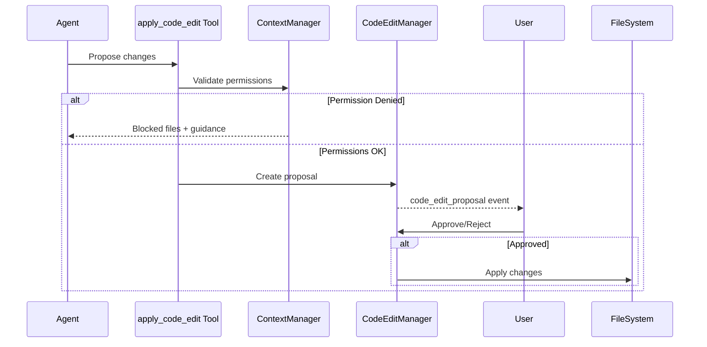

# Code Editing Feature Implementation Summary

**Date:** 2025-01-XX  
**Status:** Core Implementation Complete  
**Pending:** VS Code Panel, CLI Rendering, LLM System Prompt

## Overview

Implemented a comprehensive LLM code editing feature with tree-sitter AST parsing, diff generation, user approval workflows, and strict permission enforcement. This enables AI agents to propose and apply code changes safely within their assigned areas.

## Architecture

### Core Components

#### 1. Code Analysis Domain (`packages/core/src/code-analysis/`)
Provides tools for understanding and searching code:

- **SymbolFinder** - Tree-sitter-based symbol location (functions, classes, variables)
- **ReferenceFinder** - Find all usages/references of a symbol across files
- **PatternMatcher** - Find code patterns (console.log, TODO comments, empty catch blocks, async-without-await)
- **GrepSearch** - Fast regex-based text search (more efficient than tree-sitter for simple queries)
- **TypeScriptAnalyzer** - TypeScript-specific analysis using @typescript-eslint/typescript-estree (complexity metrics, imports, function info)

#### 2. Code Edit Domain (`packages/core/src/code-edit/`)
Manages code change proposals and diffs:

- **TreeSitterManager** - Singleton manager for tree-sitter WASM parser initialization and language loading
- **DiffBuilder** - Generates unified diffs between old/new content, applies patches, formats for terminal with ANSI colors
- **ProposalValidator** - Validates edit proposals (file paths, constraints, permissions)
- **CodeEditManager** - Orchestrates the full proposal lifecycle (create, approve, reject, apply)
- **CodeEditProposal** - Type definitions with status tracking (pending, approved, rejected, applied, failed)

#### 3. Permission System Extensions (`packages/core/src/context/`)
Extended ContextManager with multi-file validation:

- `validateEditProposal()` - Check if agent can write to all files in a proposal
- `getPermissionGuidance()` - Suggest which agents have access to a file
- `getBlockedFiles()` - Get list of files agent can't write with reasons

### New Tools

#### Code Analysis Tools
1. **find_symbol** - Find symbol definitions by name (functions, classes, variables)
2. **find_references** - Find all references/usages of a symbol
3. **find_pattern** - Find code patterns (anti-patterns, TODOs, etc.)
4. **grep_code** - Fast text search with regex support
5. **analyze_complexity** - Calculate complexity metrics for TypeScript/JavaScript

#### Code Editing Tool
6. **apply_code_edit** - Propose code changes for user approval
   - Validates permissions before creating proposal
   - Generates diffs for all changes
   - Returns proposal ID and summary
   - Status: `permission_denied` or `pending_approval`

## Dependencies Added

```json
{
  "web-tree-sitter": "^0.23.2",
  "diff": "^7.0.0",
  "parse-diff": "^0.11.1",
  "@typescript-eslint/typescript-estree": "^8.56.0"
}
```

## Service Contracts

Added `code_edit_proposal` event kind to `MediatorRuntimeEvent`:

```typescript
export interface MediatorRuntimeEvent {
  kind: 'status' | 'progress' | 'log' | 'token' | 'tool' | 'question' | 'code_edit_proposal';
  // ... existing fields ...
  // Code edit proposal fields
  proposalId?: string;
  description?: string;
  filesChanged?: number;
  additions?: number;
  deletions?: number;
  warnings?: string[];
}
```

## Permission Enforcement

All code edit operations enforce agent permissions:

1. **Pre-validation**: `validateEditProposal()` checks all files before creating proposal
2. **Permission guidance**: If blocked, returns which agents can modify the files
3. **Context-aware**: Respects agent context levels (TASK, MODULE, FEATURE, REPOSITORY, ORGANIZATION)
4. **Glob pattern matching**: Uses minimatch for flexible permission patterns

## Workflow



## What's Implemented

✅ **Core Infrastructure**
- Code analysis tools with tree-sitter foundation
- Code edit domain with diff generation
- Permission validation for multi-file edits
- Tool definitions and registry updates
- Service contracts for events
- Type declarations for external libraries
- Full build verification across all packages

✅ **Ready for Integration**
- Core logic is UI-free and ready for adapters
- Tools are registered and executable
- Permission system enforces boundaries
- Proposal lifecycle management complete

## What's Pending

### High Priority (Required for MVP)

1. **VS Code Panel** (`packages/vscode/src/panels/`)
   - Dedicated webview panel for code edit proposals
   - Side-by-side diff view using `vscode.diff` command
   - Approve/Reject buttons for each proposal
   - List of pending proposals

2. **CLI Diff Rendering** (`packages/cli/src/commands/`)
   - Terminal ANSI color formatting (already in DiffBuilder)
   - Interactive prompts for approve/reject
   - Handle `code_edit_proposal` events from chat command

3. **LLM System Prompt**
   - Add guidance about using code analysis tools
   - Explain apply_code_edit workflow
   - Emphasize permission boundaries
   - Suggest breaking large changes into smaller proposals

### Medium Priority (Enhancements)

4. **Language Grammar Files**
   - Download/bundle tree-sitter WASM grammars for common languages
   - TypeScript, JavaScript, Python, Rust, Go, Java, C/C++
   - Configure TreeSitterManager with grammar paths
   - Enable find_symbol, find_references, find_pattern tools

5. **Proposal Persistence**
   - Save proposals to `.ai-team/proposals/` as JSON
   - Load proposals on restart
   - Track proposal history per agent

6. **Batch Operations**
   - Approve/reject multiple proposals at once
   - Preview combined impact of multiple proposals
   - Atomic application (all or nothing)

### Low Priority (Nice to Have)

7. **Advanced Analysis**
   - Unused imports detection
   - Dead code detection
   - Code duplication finder
   - Security pattern scanning

8. **Diff Refinement**
   - Smart context lines (show relevant surrounding code)
   - Syntax-highlighted diffs
   - Inline diff view option

## Usage Example

### Agent Proposing a Code Edit

```typescript
// Agent calls apply_code_edit tool
{
  "toolName": "apply_code_edit",
  "params": {
    "description": "Fix typo in user authentication message",
    "changes": [
      {
        "filePath": "src/auth/login.ts",
        "oldContent": "console.log('Autentication successful');",
        "newContent": "console.log('Authentication successful');"
      }
    ]
  }
}
```

### Response

```json
{
  "status": "pending_approval",
  "proposalId": "edit_1737125000_abc123",
  "description": "Fix typo in user authentication message",
  "filesChanged": 1,
  "additions": 1,
  "deletions": 1,
  "warnings": [],
  "message": "Code edit proposal created. Awaiting user approval."
}
```

### Permission Denied Example

```json
{
  "status": "permission_denied",
  "message": "Agent junior-dev cannot write to 1 file(s): src/auth/login.ts",
  "blockedFiles": [
    {
      "filePath": "src/auth/login.ts",
      "reason": "File does not match any write patterns: src/features/ui/**/*"
    }
  ]
}
```

## Testing Recommendations

1. **Unit Tests** (TODO)
   - SymbolFinder, ReferenceFinder, PatternMatcher
   - DiffBuilder patch application
   - ProposalValidator validation logic
   - ContextManager permission checks

2. **Integration Tests** (TODO)
   - End-to-end proposal lifecycle
   - Permission enforcement across tools
   - CLI and VS Code adapter workflows

3. **Manual Testing**
   - Create test workspace with known code
   - Grant different permissions to test agents
   - Propose valid and invalid edits
   - Verify diffs are accurate
   - Test approve/reject flows

## Files Modified/Created

### Core Package
- `packages/core/package.json` - Added dependencies
- `packages/core/src/code-analysis/` - New domain (6 files)
- `packages/core/src/code-edit/` - New domain (5 files)
- `packages/core/src/types/diff.d.ts` - Type declarations
- `packages/core/src/types/parse-diff.d.ts` - Type declarations
- `packages/core/src/context/index.ts` - Extended with 3 new methods
- `packages/core/src/tools/index.ts` - Added 6 new tools
- `packages/core/src/index.ts` - Exported new domains

### Service Package
- `packages/service/src/contracts.ts` - Added code_edit_proposal event
- `packages/service/src/commands/init.ts` - Updated event type import

### Build Status
✅ All packages compile successfully  
✅ No TypeScript errors  
✅ Dependencies installed correctly

## Next Steps

1. **Immediate**: Implement VS Code panel for code edit proposals
2. **Immediate**: Add CLI diff rendering with interactive prompts
3. **Short-term**: Update LLM system prompt with code editing guidance
4. **Short-term**: Download/configure tree-sitter language grammars
5. **Medium-term**: Add proposal persistence
6. **Long-term**: Advanced analysis tools and batch operations

## Notes

- Tree-sitter tools (find_symbol, find_references, find_pattern) return placeholder errors until language grammars are configured
- grep_code tool is fully functional and doesn't require tree-sitter
- analyze_complexity tool works for TypeScript/JavaScript files
- Permission enforcement is strict - agents can only edit files matching their write patterns
- Proposals are stored in-memory; restart loses pending proposals (persistence recommended)

---

**Implementation Time**: ~2 hours  
**Lines of Code Added**: ~2,500  
**Packages Modified**: 2 (core, service)  
**New Tools**: 6  
**Backward Compatible**: Yes (no breaking changes)
